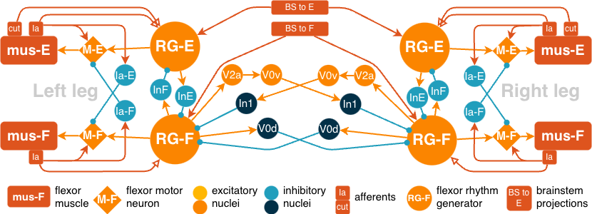

# PLAN — Migrating the rat NEST CPG model to human parameters

Status: **draft for review, revision 3** (2026-09-24). Decisions D1–D7 are agreed
(§4). Nothing in this plan has been implemented yet.

This plan moves `cpg_2legs_fast.py` from rat to human parameters. The circuit,
plasticity and consolidation mechanisms stay the same. What changes is timing,
delays, muscle and afferent dynamics, the SCI and stimulation protocol, and the
validation data. The rat model must keep working unchanged as the regression
baseline.

Contents:

1. The human CPG model
2. Migration phases
3. Order and dependencies
4. Decisions
5. References to verify
6. Guiding principles
7. Current state: what blocks a human run

---

## 1. The human CPG model

### 1.1 Circuit



*Figure 1 — Two-leg spinal CPG schematic
([`paper/figures/fig1_schematic.png`](paper/figures/fig1_schematic.png)).
Orange: excitatory populations. Blue and dark blue: inhibitory populations.
Boxes: muscles, afferents and brainstem projections.*

The two legs are mirror images. Each leg has:

- **A rhythm generator with two half-centres:** an extensor half-centre
  (**RG-E**) and a flexor half-centre (**RG-F**). They inhibit each other
  through the inhibitory interneurons **InE** (E → F) and **InF** (F → E). The
  inhibition is asymmetric: F→E is about 6× stronger than E→F (Zhang 2022).
  This ratio is a core commitment of the model.
- **A motor layer.** The motoneuron pools **M-E** and **M-F** drive the
  muscles **mus-E** and **mus-F**. Muscle activity is converted into force and
  length, which set the rates of the **Ia** afferents. The Ia afferents
  project back onto the motoneurons and onto the Ia inhibitory interneurons
  **Ia-E** and **Ia-F**, which provide reciprocal inhibition between the
  antagonist motor pools. This closes the sensory loop.
- **Afferent inputs to the rhythm generator.** The **cutaneous** afferent
  (**cut**), a foot-contact/stance signal, and the **Ia** afferents excite
  their own-side rhythm-generator half-centre (CUT→RG-E, Ia→RG-E/F).
- **Descending drive.** Tonic brainstem (reticulospinal) projections, **BS to
  E** and **BS to F**, reach both legs' half-centres.

**Left–right coupling.** The figure shows the biological commissural classes
(Shevtsova 2015; Danner 2017):

- V2a → V0v → In1: an excitatory pathway ending in inhibition;
- V0d: direct inhibition.

Both act between the two RG-F centres. In the NEST implementation, these
classes are **lumped** into direct commissural inhibition: strong RG-F → RG-F
and weak RG-E → RG-E (`P_COMM_*`, `W_COMM_*`). The figure is the target
architecture; the code is its reduced form.

The same circuit represents both conditions:

- **Healthy:** full descending drive and full loading.
- **Injured:**
  - reduced or frozen descending drive (`--freeze-bs-rg`, lower BS rate);
  - reduced loading and afferent input (`--ia-feedback-gain`,
    `--cut-feedback-gain`);
  - later, epidural stimulation (Phase 7).

### 1.2 Neuron parameters

All spinal neurons use NEST's `izhikevich` model with canonical parameter
sets:

| Population | Izhikevich type | a, b, c, d |
|---|---|---|
| RG-E, M-E, M-F | regular spiking | 0.02, 0.2, −65, 8 |
| RG-F | bursting/chattering-like (intrinsic burster standing in for INaP) | 0.02, 0.2, −55, 4 |
| InE, InF, Ia-E, Ia-F interneurons | fast spiking | 0.1, 0.2, −65, 2 |

- **Inputs:** afferents (CUT, Ia) and brainstem drive are Poisson or regular
  spike generators, relayed through `parrot_neuron`s.
- **Muscles:** parrot relays that feed a rate-based activation → force →
  length model. That model is computed in Python every `--rate-update-ms`.
- **Population sizes:** 100 per RG half-centre, motor pool and afferent
  group; 50 per interneuron group. `--debug-small` is smaller.

**Note on species.** These parameters are **abstract**, not fitted to rat or
human data, and they are identical for both species today. Per decision D6:

- the **local/debug** human configuration keeps them abstract;
- the **MN5 production** configuration will be **fully species-fitted to
  adult humans** (neuron parameters, population sizes, muscle model). See
  Phase 9.

### 1.3 Delays — goal: human conduction delays

**Goal:** every delay in the human model is a human conduction delay. Each
one is computed as `syn_delay + path_length / conduction_velocity + jitter`
for a reference adult of **1.74 m** (D7). The delays are defined in the
species YAML, so a human run cannot use any other delays (D2).

Target delays at 1.74 m. All values are estimates to be calibrated in
Phase 2; path lengths and velocities still need sources:

| Path (model key) | Anatomy | Path length | Target delay | Basis |
|---|---|---|---|---|
| `ia_path` | soleus Ia afferent → L5/S1 | ~0.8–1.0 m | ~12–16 ms | large myelinated afferent, ~60 m/s |
| `m_to_mus` | L5/S1 motoneuron → soleus / TA | ~0.8–1.0 m | ~13–17 ms | α-motor axon, ~50 m/s |
| `cut_to_rg` | plantar cutaneous afferent → lumbar cord | ~1.0 m | ~15–22 ms | Aβ afferent, ~45–60 m/s |
| `bs_to_rg`, `base_to_rg` | brainstem → lumbar cord (reticulospinal) | ~0.5 m | ~5–10 ms (to verify) | fast descending tract; low priority because BS drive is tonic |
| `rg_rec`, `rg_recip`, `motor_e2f`, `motor_f2e` | intraspinal, within segment | mm–cm | ~1–2 ms | synaptic delay dominates |
| `commissural` | crossing the cord | mm–cm | ~1–3 ms | synaptic delay dominates |

**Closed-loop check:** `ia_path` + central (~1–2 ms) + `m_to_mus` must sum to
the human soleus H-reflex latency of **~30 ms** (Palmieri et al. 2004). This
is measured with the reflex-latency probe in Phase 2. Peripheral path lengths
are stored as fractions of `height_m`, so the whole table rescales with body
size.

**Current state (§7, B3):** the existing `DELAY_PRESETS["human"]` gives
rat-like delays of about 1.7–2.3 ms. The peripheral paths are about 10× too
short, and `--species` is ignored under `--delay-model fixed`. Phase 1 makes
delays part of the species YAML, and Phase 2 sets and calibrates the values
above.

### 1.4 Bio-plausible spinal plasticity

The plasticity is taken as-is from tinyCPG
[`feature/spinal-tag-capture-consolidation`](https://github.com/max-talanov/tinyCPG/tree/feature/spinal-tag-capture-consolidation).
That branch is merged into this repo's `main`. Its literature specification,
[`spinal_plasticity_as_learning_spec.md`](spinal_plasticity_as_learning_spec.md),
is on `main` unchanged from the branch.

**Three plastic pathways**, each a NEST `stdp_synapse` (multiplicative STDP,
λ = 1e-3, τ₊ = 20 ms):

| Pathway | Wmax | Role |
|---|---|---|
| BS → RG-E/F | 30 | descending drive; frozen in the sensory-learning / SCI arm |
| CUT → RG-E | 120 | foot-contact drive for stance |
| Ia → RG-E / Ia → RG-F | 10; raised when unloaded | proprioceptive, in-phase |

**Tag-and-capture consolidation (`--consolidate`).** Vanilla STDP keeps every
potentiation forever. Spinal plasticity instead has a fast, decaying change
that becomes permanent only if a slower gating signal arrives in time. In the
model:

- The STDP weight is the fast **tag**.
- A per-connection **baseline** holds the captured, stable component.
- The tag decays toward the baseline with time constant τ_tag unless a
  per-leg, PRP-pool-like accumulator crosses a threshold. When it does, the
  current weight is captured as the new baseline.
- Stance bouts that end on a genuine force threshold push the accumulator
  up. Bouts forced by the failsafe timer push it down.

**Literature grounding** (spec §2 and §4):

- **Ia→RG ↔ Wolpaw's operant H-reflex conditioning.** This has a two-phase
  (fast/slow) time course and has been shown to restore locomotor symmetry
  (Wolpaw 2010; Chen et al. 2006).
- **CUT→RG-E ↔ Grau's contingency-gated spinal learning.** Non-contingent
  outcomes actively suppress learning. The model's "genuine vs.
  failsafe-forced" bout signal plays that role.
- **BS→RG** is the weakest fit (by analogy to corticospinal LTP).
- **Serotonergic gating** (5-HT2/5-HT7) is the best-documented supply side of
  consolidation and the most directly therapeutic (spec §2.1).

**Two model failure modes match maladaptive spinal plasticity** (spec §2.4
and §4):

- **Cap-domination** (`frac_at_cap` → 1): a positive-feedback loop that never
  releases.
- **L/R synchronisation**: over-consolidation.

**Caveats for the human model:**

- The spec's evidence is mostly rat, with some cat and mouse. Directly human
  evidence in the spec is limited to intermittent-hypoxia walking trials
  (Hayes et al. 2014; Tan et al. 2020). Human operant H-reflex conditioning
  after incomplete SCI (Thompson et al. 2013, to verify) is the most relevant
  addition to look for. It is the human counterpart of the Ia→RG mapping.
- Since 2026-09-17, consolidation is also written back to `BS→RG` (spec §4,
  updated 2026-09-24; CLAUDE.md, "Tag-and-capture consolidation").
  Descending-arm consolidation results from before that date need
  re-confirmation.

---

## 2. Migration phases

Each phase lists its **goal**, the **changes** it makes, its **acceptance
criteria** and its **risks**. Size is a rough relative effort: S, M or L.
Blocker IDs (B1–B10) are listed in §7.

**Plasticity reference.** All plasticity and consolidation logic comes from
tinyCPG
[`feature/spinal-tag-capture-consolidation`](https://github.com/max-talanov/tinyCPG/tree/feature/spinal-tag-capture-consolidation),
with its literature spec
[`spinal_plasticity_as_learning_spec.md`](spinal_plasticity_as_learning_spec.md).
None of the phases below changes the learning rules. Phases 5–7 only rescale
their **time constants** (τ_tag, gate cadence) to human bout durations and
session protocols. Any change to the rules themselves must be flagged and
checked against the spec. New upstream work on that branch can be merged with
`git fetch tinycpg feature/spinal-tag-capture-consolidation` followed by a
merge (see README).

### Phase 0 — Safety net (S)

**Goal:** make rat regressions detectable before touching the model.

**Changes**
- Record rat "golden" outputs from `debug.sh` and `debug_force.sh`, with fixed
  seed and fixed `--threads`, under `results/golden/rat/`. They stay local
  because `*.h5` is git-ignored. A checksum manifest is committed.
- Add `scripts/regression_compare.py`. It compares two HDF5 files array by
  array (rates, force, activation, `cut_on`, weights) and exits non-zero on any
  difference, or on a difference above a tolerance if one is given.
- Add `regress.sh`, which re-runs both debug configs and compares them against
  the golden files.

**Acceptance:** two consecutive runs of `regress.sh` on the untouched code
give identical output.

**Risk:** NEST results depend on the thread count, so the golden files must
record `--threads`.

### Phase 1 — Species configuration in YAML (M)

**Goal:** one place for all species-dependent values, **with delays tied to
the species**. No behaviour change yet. Implements D1, D2 and D7.

**Changes**
- Add YAML configuration files. PyYAML becomes a dependency: add it to
  `requirements.txt` and check that it exists in the MN5 NEST environment.

  ```
  config/
    species/
      rat.yaml            # species: rat;   delays: ../delays/rat.yaml
      human.yaml          # species: human; delays: ../delays/human.yaml;
                          #   body: {height_m: 1.74}; profile: abstract
      human_adult.yaml    # extends: human.yaml; profile: adult  (Phase 9, MN5)
    delays/
      rat.yaml            # model: length_velocity; per-path syn/length/velocity
      human.yaml          # model: length_velocity; peripheral paths as fractions
                          #   of body height; intraspinal paths absolute
    modes/
      rat.yaml            # (optional) rat per-mode timing, mirrors the rat scripts
      human.yaml          # slow / comfortable / fast / BWS timing (Phase 5)
    plasticity.yaml       # species-agnostic STDP + consolidation defaults
  ```

- **Every species file must name its delay file** (`delays:` key). The loader
  refuses a species file without one. Per D2, there is no way to run a
  species without its delays.
- `--species rat|human|human_adult` loads `config/species/<name>.yaml`.
  `--species-config <path>` loads a custom file. The old `--delay-model` flag
  is **deprecated**: it is accepted only if it matches the model declared in
  the species' delay file, and fails otherwise.
- All existing rat scripts already pass `--delay-model length_velocity`, so
  they keep working without edits. The legacy `fixed` model is not reachable
  through any species file. It could be kept as an explicit
  `delays/rat_fixed.yaml` if you ever need it.
- `rat.yaml` and `delays/rat.yaml` hold exactly today's constants and today's
  rat `DELAY_PRESETS`.
- `human.yaml` holds `body.height_m: 1.74` (D7). Peripheral path lengths are
  computed as `fraction × height_m`, using segment-length ratios
  (Winter 2009, to verify), so a different height is a one-line change.
- Resolution order: YAML defaults → mode file → CLI flags. The fully resolved
  configuration, including the delay table and height, is written to the
  HDF5 attributes and dumped next to each output as `<out>.config.yaml`.
- Fix the `--stance-fraction` help text so it states one meaning (B2). The
  meaning itself is settled in Phase 3.

**Acceptance**
- `regress.sh` passes: rat is byte-identical when loaded from YAML.
- A `--species human` run records its resolved configuration.
- A species file without `delays:` fails to load.

### Phase 2 — Human conduction delays (M)

**Goal:** reach the human delay targets in §1.3, with the H-reflex loop at
~30 ms (fixes B3).

**Changes**
- In `config/delays/human.yaml`, split the paths into **peripheral**
  (`ia_path`, `cut_to_rg`, `m_to_mus`) and **intraspinal** (`rg_rec`,
  `rg_recip`, `motor_*`, `commissural`, which stay at about 1–2 ms).
- Peripheral path lengths come from the reference adult (1.74 m; soleus ↔
  L5/S1 about 0.8–1.0 m each way). Tune conduction velocities within human
  ranges so the loop latency hits its target. Do not trust any single
  velocity figure. Illustration: 0.9 m afferent at ~60 m/s (~15 ms), plus
  ~1–2 ms central, plus 0.9 m efferent at ~50 m/s (~18 ms), gives ~34 ms.
- Reticulospinal `bs_to_rg` (~0.5 m) is low priority, because BS drive is
  tonic and its delay hardly affects the rhythm.
- Add a **reflex-latency probe**, `scripts/probe_reflex_latency.py` or a
  `--probe-reflex` flag. With plasticity off, it sends one synchronous volley
  into Ia-E and measures the latency to the first `mus-E` response. This is
  the model analogue of the H-reflex.
- Document how the Python sensory loop adds to the latency. Ia and CUT rates
  are recomputed only every `--rate-update-ms` (20 ms by default). Consider
  10 ms for human runs and check the effect on speed.

**Acceptance**
- Probe latency is 28–35 ms at 1.74 m (target ~30 ms; Palmieri et al. 2004).
  It scales with `height_m`.
- `--dump-connectivity` shows the new delay arrays.
- The rat regression passes.

**Risk:** a larger NEST `max_delay` slightly changes how NEST communicates
between threads and MPI ranks, which could affect run time. Measure it.

### Phase 3 — Human gait scheduler with double support (L)

**Goal:** allow human stance ≈ 60% with ~10% double support at each
transition (fixes B1).

**Changes**
- Replace the sequential half-cycle schedule with a **per-leg phase
  schedule**. Each leg has its own stance window `[φ_leg, φ_leg + f_st·T)` and
  R is offset from L by `T/2`. With `f_st > 0.5`, the windows overlap and
  double support emerges. With `f_st = 0.5`, the rat schedule is reproduced
  exactly, which is the regression requirement.
- Settle what `--stance-fraction` means: fraction of the **full stride** that
  each leg spends in stance.
- Update the heel→mid→toe Ia-E sub-groups (`SUB_STANCE_MS`) and the flexor
  swing afferent (`--ia-ext-f-hz`) to follow the new per-leg windows.
- Force-trigger mode (`--cut-trigger force`) already uses independent per-leg
  Schmitt triggers, so overlap is allowed in principle. However, the lead
  offset, priming window and commissural inhibition were all tuned for strict
  alternation. Re-check them.

**Acceptance**
- Timer mode at `--species human`, comfortable speed: measured stance
  fraction (from `cut_on`) is 0.60 ± 0.03, double support is 8–12% per
  transition, and L/R anti-phase holds.
- Rat regression passes with `f_st = 0.5`.

**Risk:** the highest-risk phase. Commissural inhibition on RG-E may fight
double support. **Per D4 (agreed):** if needed, weaken `W_COMM_E_INH` in the
human configuration only. The change is flagged in the commit and in
CLAUDE.md; the rat value is untouched.

### Phase 4 — Muscle and afferent model (M)

**Goal:** human contraction dynamics and afferent rates (B5, B6).

**Changes**
- Split force and activation τ by pool. **Per D3 (agreed):** the extensor
  pool is modelled as **soleus** (slow-twitch dominant) and the flexor pool
  as **tibialis anterior**. Take twitch time-to-peak values from the
  literature. The source still has to be verified; the soleus target is on
  the order of 100 ms. Note that the current paced-gait override (80/80 ms)
  is already close to the soleus scale, so the change may be small for E.
- Rescale `TAU_LENGTH_MS`, `SHORTEN_GAIN` and `STRETCH_GAIN` to the longer
  human stance.
- First **measure** the Ia and CUT rate distributions the model actually
  produces. Then set `IA_RATE_MAX_HZ`, `IA_K_FORCE`, `IA_K_STRETCH` and
  `CUT_RATE_ON_HZ` against human microneurography, which is still to be
  sourced. Plantar cutaneous afferents: Kennedy & Inglis 2002.
- All values go into `config/species/human.yaml`, not into code constants.

**Acceptance**
- Force-E rises through stance and reaches the CUT-OFF threshold within the
  human stance window. Force-trigger mode needs this; see the rat "Muscle
  fatigue" notes.
- Ia and CUT rates stay within the sourced human ranges.

### Phase 5 — Human locomotion modes and force-trigger operating point (L)

**Goal:** stable, genuinely closed-loop human gait across speeds and loading
conditions.

**Changes**
- Define the human modes in `config/modes/human.yaml` and in new scripts,
  `debug_human.sh`, `debug_force_human.sh` and `run_*_human.sh`. Rat scripts
  stay untouched.

  | Mode | Stride (ms) | Stance fraction | Stands in for |
  |---|---|---|---|
  | slow | ~1300–1500 | ~0.62–0.65 | slow walking |
  | comfortable | ~1000–1200 | ~0.60 | self-selected speed, ~1.2–1.4 m/s |
  | fast | ~900 | ~0.57 | fast walking |
  | BWS-x% | as comfortable | as comfortable | body-weight-supported treadmill stepping; replaces rat toe and air stepping via `--ia-feedback-gain` / `--cut-feedback-gain` |

- Rescale per mode, together: `--cut-max-stance-ms`, `--cut-max-swing-ms`,
  fatigue onset and recovery τ, `--cut-force-off-frac`, `--lead-offset-ms`
  and `--consolidate-tau-tag-ms`. The first guess for each is the rat value
  × (human bout ÷ rat bout). After that, run a small local sweep like rat
  rounds 3–5, at `--debug-small`.
- The consolidation mechanism is unchanged from the tinyCPG plasticity
  branch. Only τ_tag is re-confirmed per human mode, following the rat rule
  that τ_tag scales with bout length and loading.
- Check **tick alignment**: stride and stance durations must not be exact
  multiples of the gate tick. See "Medium's tick-alignment fragility" in the
  rat history.

**Acceptance, per mode, force-trigger, debug-small then production:**
- `frac_at_cap` ≈ 0 on both legs, confirmed with `cut_on` ground truth.
- corr(Force-E, Force-F) and corr(Force-E_L, Force-E_R) in the rat-recalibrated
  target band (−0.6 to −0.8), with no L/R synchronisation.
- Measured stride period and stance fraction within ±5% of the mode target.

### Phase 6 — Plasticity time course and multi-session rehabilitation (M)

**Goal:** make "gradual rehabilitation" a protocol, not a single run (B8).

**Changes**
- Add `--init-weights-from <h5>`. It restores plastic weights, and
  `baseline`/`prp_pool` when `--consolidate` is on, from a previous run's
  final snapshot. This allows **session → rest → session** chains.
- Define the protocol: N simulated training sessions of M minutes each, with
  weights carried between sessions. Consolidation handles offline retention.
  Real weeks cannot be simulated, so compare the **shape** of the recovery
  curve (sessions to criterion, retention between sessions) with human
  training studies, not absolute days.
- Keep STDP λ in 5e-4 to 5e-3, which is species-agnostic. Re-confirm
  `tau_tag_ms` per human mode (Phase 5).
- Map the protocol onto the spec's gating signals. For example, a
  serotonergic-gating "supply" parameter per session (spec §2.1) is the model
  counterpart of adjuvants such as intermittent hypoxia (Hayes et al. 2014).
  This is optional and must be flagged before it is implemented.

**Acceptance:** a 5-session chain on the incomplete-SCI configuration
(Phase 7b) improves gait metrics gradually and monotonically, not in one
jump, and keeps them across the session boundaries.

### Phase 7 — Healthy → incomplete SCI → complete SCI, with epidural stimulation (L)

**Goal:** the three conditions on the same circuit, in the agreed order (D5),
plus epidural electrical stimulation (EES) (B7).

**Shared change:** add EES as a tonic afferent input. EES mainly recruits large
proprioceptive afferents in the dorsal roots (Capogrosso et al. 2013), so model
it as a pulse train at `--ees-hz` and `--ees-amp` onto the Ia-E and Ia-F
populations, not phase-gated. A later option is spatiotemporal (phase-gated)
EES (Wagner et al. 2018). The existing external Ia-E heel→toe ramp, described
in the code as epidural-stim pacing, must be clearly separated from the new
tonic EES.

- **7a — Healthy.** Full BS drive and full loading, at all Phase 5 modes.
  This is the reference every SCI result is compared against.
  **Acceptance:** Phase 5 criteria, plus EES off leaves the output unchanged.
- **7b — Incomplete SCI.** Reduced BS rate and/or weak frozen BS→RG, combined
  with BWS loading levels. Run with and without EES, and with and without
  multi-session training (Phase 6).
  **Acceptance:** stepping degrades relative to 7a without intervention, and
  recovers gradually with training ± EES. This is the qualitative pattern of
  EES + training in incomplete SCI (Wagner et al. 2018).
- **7c — Complete SCI.** BS off or near zero.
  **Acceptance:** qualitative reproduction of the human EES frequency
  dependence. EES at ~5–15 Hz gives tonic extensor activity; ~25–50 Hz gives
  rhythmic E/F alternation (Minassian et al. 2004).

### Phase 8 — Validation against human data (M, plus data access)

**Goal:** quantitative comparison with human recordings, in the same order:
healthy, then incomplete SCI, then complete SCI.

**Changes**
- Write `validation/human_data_sources.md`, the human counterpart of the rat
  `emg_data_requests.md`. Candidate public healthy-gait datasets, whose
  contents and licences still need checking:
  - Schreiber & Moissenet 2019 (Sci Data): multi-speed gait with EMG;
  - Lencioni et al. 2019 (Sci Data): walking with EMG;
  - Fukuchi et al. 2018 (PeerJ): speed-dependent kinematics and kinetics.

  Human SCI EMG under EES/training is mostly not public, so it will likely
  need data requests.
- Add `scripts/cpg_human_gait_metrics.py`, which computes metrics from model
  HDF5 and dataset files in one format:
  - stride period vs. speed;
  - stance fraction and double support;
  - soleus/TA envelope onset and offset (% gait cycle) vs. model motor-pool
    rate;
  - E/F co-activation index;
  - L/R phase.

**Acceptance:** model metrics within the inter-subject range of the chosen
healthy dataset at each speed. SCI comparisons are qualitative until data is
obtained.

### Phase 9 — Adult-human production profile (MN5) and paper (L)

**Goal:** per D6, the MN5 production model is **fully species-fitted to adult
humans**. The local/debug model stays abstract.

**Changes**
- Create `config/species/human_adult.yaml` (`extends: human.yaml`). It adds:
  - **neuron parameters:** Izhikevich parameters re-fitted per population to
    human data. Motoneurons fitted to human motor-unit discharge rates and
    recruitment during walking; interneurons to the best available
    human/primate proxies. Sources to be collected;
  - **population sizes:** motor pools and afferent groups scaled toward human
    soleus and TA pool sizes (sources to be collected), within the MN5 compute
    budget;
  - **delays and body size:** the full human delay file at `height_m: 1.74`;
  - **muscles:** the fitted soleus/TA muscle model from Phase 4.
- Re-confirm the Phase 5 operating points under `human_adult`. Fitting can
  move them, just as production N moved the rat operating points relative to
  `--debug-small`.
- Build the MN5 array scripts `run_*_human.sh`, following the `MN5_RUN.md`
  workflow. Seeds and init robustness use the same 10-point (μ, CV) grid as
  the rat paper, so rat and human results are directly comparable.
- Update README, CLAUDE.md and the figure scripts. Figures must label species
  and profile (`human` / `human_adult`) explicitly.

**Risk:** larger populations raise MN5 cost. Benchmark one production cell
before submitting arrays.

---

## 3. Order and dependencies

```
P0 ─► P1 ─► P2 ─┬─► P4 ─► P5 ─► P6 ─► P7a ─► P7b ─► P7c ─► P9
                └─► P3 ─┘                     ▲
                    P8 (data sourcing can start now) ────┘
```

- P2 (delays) and P3 (scheduler) are independent after P1 and can run in
  parallel.
- P5 needs P3 and P4.
- P7 follows the agreed condition order: healthy, then incomplete, then
  complete.
- Data sourcing for P8, and parameter sourcing for P9 (human motor-unit and
  pool data), have the longest lead times and should start immediately.

**Suggested first milestone:** P0 + P1 + P2. The result: a regression-safe,
YAML-configured code base in which `--species human` always means human-scale
reflex latencies at 1.74 m, checked by the probe.

---

## 4. Decisions (agreed 2026-09-24)

| # | Decision | Outcome |
|---|---|---|
| D1 | Where species profiles live | **YAML files** under `config/` (Phase 1) |
| D2 | Species vs. delay model | **The species determines its delays.** Each species YAML must reference its delay YAML. Running a species without its delays is impossible, and `--delay-model` is deprecated (Phase 1) |
| D3 | Muscle identity of the pools | **Extensor = soleus, flexor = tibialis anterior** (Phase 4) |
| D4 | Human-only commissural change if double support needs it | **Allowed** in the human configuration only, flagged in the commit and in CLAUDE.md (Phase 3) |
| D5 | Condition order | **Healthy → incomplete SCI → complete SCI** (Phases 7a–7c, 8) |
| D6 | Abstract vs. species-fitted | **Local/debug stays abstract; MN5 production is fully species-fitted to adult humans** (`human_adult`, Phase 9) |
| D7 | Body size for path lengths | **From YAML, default `height_m: 1.74`** (Phases 1–2) |

---

## 5. References to verify before citing in the paper

The following are cited in CLAUDE.md and this plan. Before any number reaches
the manuscript, each one should be checked the same way the rat spec was
checked against PubMed:

- Perry & Burnfield 2010
- Bohannon & Andrews 2011
- Palmieri et al. 2004
- Minassian et al. 2004
- Dimitrijevic et al. 1998
- Harkema et al. 2011
- Angeli et al. 2018
- Gill et al. 2018
- Wagner et al. 2018
- Capogrosso et al. 2013
- Kennedy & Inglis 2002
- Winter 2009
- Thompson et al. 2013
- Schreiber & Moissenet 2019
- Lencioni et al. 2019
- Fukuchi et al. 2018

References already verified in
[`spinal_plasticity_as_learning_spec.md`](spinal_plasticity_as_learning_spec.md)
(Wolpaw 2010, Chen et al. 2006, Hayes et al. 2014, Tan et al. 2020, the Grau
series) need no re-check.

Values marked "to verify" in CLAUDE.md (soleus twitch time, human plantar
afferent rates, reticulospinal delay) have no confirmed source yet. The same
applies to the human motor-unit and pool-size data needed for Phase 9.

---

## 6. Guiding principles

1. **Rat stays byte-identical.** `--species rat`, the default, must produce
   exactly the same HDF5 output as today for the same seed and thread count.
   Every phase ends with that regression check.
2. **One switch, one configuration.** All species-dependent values, including
   delays, come from the species YAML selected by `--species`. Explicit CLI
   flags still override the YAML, except that delays cannot be detached from
   the species. The resolved values are written to the HDF5 attributes, so
   every output says which parameters it actually used.
3. **Hard targets before tuning.** Each phase has a measurable acceptance
   criterion taken from human physiology, such as reflex latency, stance
   fraction or stride period. A phase is not done because the output "looks
   right".
4. **Circuit and learning rules unchanged unless a phase says otherwise.**
   The ~6:1 asymmetric reciprocal inhibition, tonic BS, the three plastic
   pathways and the tag-and-capture rule stay as they are. The only
   pre-agreed exception is D4. Neuron parameters and population sizes stay
   abstract locally and are species-fitted only in the MN5 `human_adult`
   profile (D6).
5. **The rat lessons still apply.** Check `frac_at_cap` on every force-trigger
   run, watch for L/R synchronisation, and check tick alignment. The rat
   history in CLAUDE.md shows how these failure modes appear. They will
   reappear at human timing.

---

## 7. Current state: what blocks a human run

| # | Blocker | Where | Effect |
|---|---|---|---|
| B1 | The paced-gait scheduler is strictly sequential: one leg's stance, then the other's. `SWING_MS = HALF_MS − STANCE_MS` | `cpg_2legs_fast.py` ~L1111–1113, ~L2366–2410 | Stance can never exceed 50% of the stride, so there is **no double support**. Human stance is ~60%. With `--stance-fraction 0.6`, `SWING_MS` goes negative. |
| B2 | `--stance-fraction` help text says "fraction of HALF the step period". The code multiplies the full period. | ~L561 vs ~L1112 | The flag's meaning is ambiguous. It must be fixed before human values are set. |
| B3 | The human delay preset gives ~1.7–2.3 ms delays, the same as rat | `DELAY_PRESETS["human"]` ~L185 | The peripheral loop is ~10× too fast. The human soleus H-reflex latency is ~30 ms. |
| B4 | `--species` has no effect under the default `--delay-model fixed` | `make_delay_param` | A run labelled "human" can be pure rat without any warning. Resolved by D2 / Phase 1. |
| B5 | Muscle τ values are rat-tuned and shared between extensor and flexor (`TAU_FORCE_*`, `TAU_ACT_*`, `TAU_LENGTH_MS`). The paced-gait override is 80/80 ms. | ~L326–365, ~L1123–1126 | Human soleus (extensor) and tibialis anterior (flexor) contract at different speeds. |
| B6 | Afferent rate model has `IA_RATE_MAX_HZ = 500` and `IA_K_*` gains | ~L372–375, ~L2035–2045 | The 500 Hz cap is far above plausible human Ia rates. The real rates the model produces have not been measured yet. |
| B7 | No epidural-stimulation (EES) input | — | The key human SCI intervention cannot be modelled. |
| B8 | No weight save → restore between runs (`--save-weights` writes only) | ~L479 | Multi-session rehabilitation protocols are not possible. |
| B9 | No test or regression harness in the repo | — | Nothing checks that rat is unchanged. |
| B10 | All per-mode timing is hard-coded in rat scripts (`run_*.sh`, `debug*.sh`), and constants are hard-coded in `cpg_2legs_fast.py` | scripts, model | Human modes need their own configuration. Resolved by D1 / Phase 1 (YAML) and Phase 5 (human scripts). |
