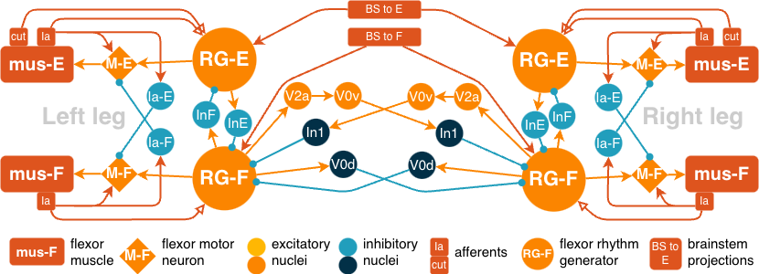

# PLAN — Migrating the rat NEST CPG model to human parameters

Status: **in progress** (2026-09-24). Decisions D1–D7 are agreed (§4).
**Done:** Phase 0 (rat regression harness; B11/B12 reproducibility fixes) and
Phase 1 (YAML species configs, delays tied to species), Phase 2 (human
conduction delays, reflex probe at 30 ms), Phase 3 (phase scheduler, human
stance 0.60 with double support) and MN5 check A (five modes at production N).
Phase 3b (size-invariant connectivity, B13 fix) is done (2026-09-26; 3× on
MN5 2026-09-28 matches 1× on 11/11 metrics; 10× timed out and is left to
check B).
**Now:** Phase 6 (started 2026-09-29: species defaults, session chains, capture calibration). Phase 5 done (three seeds per mode) apart from BWS 90%, which moved to P7c. MN5 check B (scaling benchmark and MPI-safe loop)
alongside it. P3b and check B were moved forward on 2026-09-26 so that
everything tuned from P4 on carries over to the adult-size model (P9)
without re-tuning.

This plan moves `cpg_2legs_fast.py` from rat to human parameters. The circuit,
plasticity and consolidation mechanisms stay the same. What changes is timing,
delays, muscle and afferent dynamics, the SCI and stimulation protocol, and the
validation data. The rat model must keep working unchanged as the regression
baseline.

Contents:

1. The human CPG model
2. Migration phases
3. Order and dependencies
4. Decisions
5. References to verify
6. Guiding principles
7. Current state: what blocks a human run

---

## 1. The human CPG model

### 1.1 Circuit



*Figure 1 — Two-leg spinal CPG schematic
([`paper/figures/fig1_schematic.png`](paper/figures/fig1_schematic.png)).
Orange: excitatory populations. Blue and dark blue: inhibitory populations.
Boxes: muscles, afferents and brainstem projections.*

The two legs are mirror images. Each leg has:

- **A rhythm generator with two half-centres:** an extensor half-centre
  (**RG-E**) and a flexor half-centre (**RG-F**). They inhibit each other
  through the inhibitory interneurons **InE** (E → F) and **InF** (F → E). The
  inhibition is asymmetric: F→E is about 6× stronger than E→F (Zhang 2022).
  This ratio is a core commitment of the model.
- **A motor layer.** The motoneuron pools **M-E** and **M-F** drive the
  muscles **mus-E** and **mus-F**. Muscle activity is converted into force and
  length, which set the rates of the **Ia** afferents. The Ia afferents
  project back onto the motoneurons and onto the Ia inhibitory interneurons
  **Ia-E** and **Ia-F**, which provide reciprocal inhibition between the
  antagonist motor pools. This closes the sensory loop.
- **Afferent inputs to the rhythm generator.** The **cutaneous** afferent
  (**cut**), a foot-contact/stance signal, and the **Ia** afferents excite
  their own-side rhythm-generator half-centre (CUT→RG-E, Ia→RG-E/F).
- **Descending drive.** Tonic brainstem (reticulospinal) projections, **BS to
  E** and **BS to F**, reach both legs' half-centres.

**Left–right coupling.** The figure shows the biological commissural classes
(Shevtsova 2015; Danner 2017):

- V2a → V0v → In1: an excitatory pathway ending in inhibition;
- V0d: direct inhibition.

Both act between the two RG-F centres. In the NEST implementation, these
classes are **lumped** into direct commissural inhibition: strong RG-F → RG-F
and weak RG-E → RG-E (`P_COMM_*`, `W_COMM_*`). The figure is the target
architecture; the code is its reduced form.

The same circuit represents both conditions:

- **Healthy:** full descending drive and full loading.
- **Injured:**
  - reduced or frozen descending drive (`--freeze-bs-rg`, lower BS rate);
  - reduced loading and afferent input (`--ia-feedback-gain`,
    `--cut-feedback-gain`);
  - later, epidural stimulation (Phase 7).

### 1.2 Neuron parameters

All spinal neurons use NEST's `izhikevich` model with canonical parameter
sets:

| Population | Izhikevich type | a, b, c, d |
|---|---|---|
| RG-E, M-E, M-F | regular spiking | 0.02, 0.2, −65, 8 |
| RG-F | bursting/chattering-like (intrinsic burster standing in for INaP) | 0.02, 0.2, −55, 4 |
| InE, InF, Ia-E, Ia-F interneurons | fast spiking | 0.1, 0.2, −65, 2 |

- **Inputs:** afferents (CUT, Ia) and brainstem drive are Poisson or regular
  spike generators, relayed through `parrot_neuron`s.
- **Muscles:** parrot relays that feed a rate-based activation → force →
  length model. That model is computed in Python every `--rate-update-ms`.
- **Population sizes:** 100 per RG half-centre, motor pool and afferent
  group; 50 per interneuron group. `--debug-small` is smaller.

**Note on species.** These parameters are **abstract**, not fitted to rat or
human data, and they are identical for both species today. Per decision D6:

- the **local/debug** human configuration keeps them abstract;
- the **MN5 production** configuration will be **fully species-fitted to
  adult humans** (neuron parameters, population sizes, muscle model). See
  Phase 9.

### 1.3 Delays — goal: human conduction delays

**Goal:** every delay in the human model is a human conduction delay. Each
one is computed as `syn_delay + path_length / conduction_velocity + jitter`
for a reference adult of **1.74 m** (D7). The delays are defined in the
species YAML, so a human run cannot use any other delays (D2).

Target delays at 1.74 m. All values are estimates to be calibrated in
Phase 2; path lengths and velocities still need sources:

| Path (model key) | Anatomy | Path length | Target delay | Basis |
|---|---|---|---|---|
| `ia_path` | soleus Ia afferent → L5/S1 | ~0.8–1.0 m | ~12–16 ms | large myelinated afferent, ~60 m/s |
| `m_to_mus` | L5/S1 motoneuron → soleus / TA | ~0.8–1.0 m | ~13–17 ms | α-motor axon, ~50 m/s |
| `cut_to_rg` | plantar cutaneous afferent → lumbar cord | ~1.0 m | ~15–22 ms | Aβ afferent, ~45–60 m/s |
| `bs_to_rg`, `base_to_rg` | brainstem → lumbar cord (reticulospinal) | ~0.5 m | ~5–10 ms (to verify) | fast descending tract; low priority because BS drive is tonic |
| `rg_rec`, `rg_recip`, `motor_e2f`, `motor_f2e` | intraspinal, within segment | mm–cm | ~1–2 ms | synaptic delay dominates |
| `commissural` | crossing the cord | mm–cm | ~1–3 ms | synaptic delay dominates |

**Closed-loop check:** `ia_path` + central (~1–2 ms) + `m_to_mus` must sum to
the human soleus H-reflex latency of **~30 ms** (Palmieri et al. 2004). This
is measured with the reflex-latency probe in Phase 2. Peripheral path lengths
are stored as fractions of `height_m`, so the whole table rescales with body
size.

**Status: done in Phase 2** (2026-09-25). The human table in
`config/species/human.yaml` gives Ia afferent 13.6 ms, motor axon 15.9 ms,
cutaneous 23.6 ms and reticulospinal 8.3 ms at 1.74 m. The reflex-latency
probe measures **30.2 ms**. See the Phase 2 status for details.

### 1.4 Bio-plausible spinal plasticity

The plasticity is taken as-is from tinyCPG
[`feature/spinal-tag-capture-consolidation`](https://github.com/max-talanov/tinyCPG/tree/feature/spinal-tag-capture-consolidation).
That branch is merged into this repo's `main`. Its literature specification,
[`spinal_plasticity_as_learning_spec.md`](spinal_plasticity_as_learning_spec.md),
is on `main` unchanged from the branch.

**Three plastic pathways**, each a NEST `stdp_synapse` (multiplicative STDP,
λ = 1e-3, τ₊ = 20 ms):

| Pathway | Wmax | Role |
|---|---|---|
| BS → RG-E/F | 30 | descending drive; frozen in the sensory-learning / SCI arm |
| CUT → RG-E | 120 | foot-contact drive for stance |
| Ia → RG-E / Ia → RG-F | 10; raised when unloaded | proprioceptive, in-phase |

**Tag-and-capture consolidation (`--consolidate`).** Vanilla STDP keeps every
potentiation forever. Spinal plasticity instead has a fast, decaying change
that becomes permanent only if a slower gating signal arrives in time. In the
model:

- The STDP weight is the fast **tag**.
- A per-connection **baseline** holds the captured, stable component.
- The tag decays toward the baseline with time constant τ_tag unless a
  per-leg, PRP-pool-like accumulator crosses a threshold. When it does, the
  current weight is captured as the new baseline.
- Stance bouts that end on a genuine force threshold push the accumulator
  up. Bouts forced by the failsafe timer push it down.

**Literature grounding** (spec §2 and §4):

- **Ia→RG ↔ Wolpaw's operant H-reflex conditioning.** This has a two-phase
  (fast/slow) time course and has been shown to restore locomotor symmetry
  (Wolpaw 2010; Chen et al. 2006).
- **CUT→RG-E ↔ Grau's contingency-gated spinal learning.** Non-contingent
  outcomes actively suppress learning. The model's "genuine vs.
  failsafe-forced" bout signal plays that role.
- **BS→RG** is the weakest fit (by analogy to corticospinal LTP).
- **Serotonergic gating** (5-HT2/5-HT7) is the best-documented supply side of
  consolidation and the most directly therapeutic (spec §2.1).

**Two model failure modes match maladaptive spinal plasticity** (spec §2.4
and §4):

- **Cap-domination** (`frac_at_cap` → 1): a positive-feedback loop that never
  releases.
- **L/R synchronisation**: over-consolidation.

**Caveats for the human model:**

- The spec's evidence is mostly rat, with some cat and mouse. Directly human
  evidence in the spec is limited to intermittent-hypoxia walking trials
  (Hayes et al. 2014; Tan et al. 2020). Human operant H-reflex conditioning
  after incomplete SCI (Thompson et al. 2013, to verify) is the most relevant
  addition to look for. It is the human counterpart of the Ia→RG mapping.
- Since 2026-09-17, consolidation is also written back to `BS→RG` (spec §4,
  updated 2026-09-24; CLAUDE.md, "Tag-and-capture consolidation").
  Descending-arm consolidation results from before that date need
  re-confirmation.

**Plasticity roadmap for the human model (agreed 2026-09-26).** Everything is
already implemented, but no human run has used consolidation yet: all human
runs so far (P2, P3, MN5 check A) are **vanilla STDP** under the timer-paced
gait. `--consolidate` requires `--cut-trigger force`, because capture depends
on whether a stance bout ended on a genuine force threshold or on the failsafe
timer, and that signal does not exist in paced mode. So:

1. **Phase 3b:** fix B13 (consolidate the full synapse collection) and run a
   mechanics smoke test of force-trigger + `--consolidate` on human. This is
   not yet an operating point.
2. **Phase 4:** human muscle so that Force-E reaches the CUT-OFF threshold
   within human stance. This is the precondition for force-trigger, and so
   for consolidation.
3. **Phase 5: vanilla STDP is retired for human.** The human default becomes
   force-trigger + consolidation (`human.yaml`: `cut_trigger: force`,
   `consolidate: true`), and the P5 operating points are tuned with the full
   rule. Vanilla STDP stays only as the rat baseline and as an explicit
   human ablation control (`--no-consolidate`).
4. **Phases 5–6:** rescale τ_tag and the gate cadence to human bouts and
   strides. P6 adds weight save/restore for multi-session training.
5. **Phase 7:** the human SCI pieces:
   - serotonergic gating of consolidation (spec §2.1);
   - EES as its driver;
   - a check of Ia→RG plasticity against human operant H-reflex conditioning
     (Thompson et al. 2013, to verify).

---

## 2. Migration phases

Each phase lists its **goal**, the **changes** it makes, its **acceptance
criteria** and its **risks**. Size is a rough relative effort: S, M or L.
Blocker IDs (B1–B10) are listed in §7.

**Plasticity reference.** All plasticity and consolidation logic comes from
tinyCPG
[`feature/spinal-tag-capture-consolidation`](https://github.com/max-talanov/tinyCPG/tree/feature/spinal-tag-capture-consolidation),
with its literature spec
[`spinal_plasticity_as_learning_spec.md`](spinal_plasticity_as_learning_spec.md).
None of the phases below changes the learning rules. Phases 5–7 only rescale
their **time constants** (τ_tag, gate cadence) to human bout durations and
session protocols. Any change to the rules themselves must be flagged and
checked against the spec. New upstream work on that branch can be merged with
`git fetch tinycpg feature/spinal-tag-capture-consolidation` followed by a
merge (see README).

### Phase 0 — Safety net (S)

**Goal:** make rat regressions detectable before touching the model.

**Changes**
- Record rat "golden" outputs from `rat-sh/debug.sh` and `rat-sh/debug_force.sh`, with fixed
  seed and fixed `--threads`, under `results/golden/rat/`. They stay local
  because `*.h5` is git-ignored. A checksum manifest is committed.
- Add `scripts/regression_compare.py`. It compares two HDF5 files array by
  array (rates, force, activation, `cut_on`, weights) and exits non-zero on any
  difference, or on a difference above a tolerance if one is given.
- Add `regress.sh`, which re-runs both debug configs and compares them against
  the golden files.

**Acceptance:** two consecutive runs of `regress.sh` on the untouched code
give identical output.

**Risk:** NEST results depend on the thread count, so the golden files must
record `--threads`.

**Status: done (2026-09-24, local, 4 threads).**

- P0 found two reproducibility bugs in the rat model, B11 and B12 (§7). Both
  are fixed, with your approval, because a regression baseline is meaningless
  without them.
- The fixes change rat output once. The new output is statistically
  equivalent: same connection statistics, with seeds now actually honoured.
- The golden run was recorded after the fixes. Its digests are in
  `results/golden/rat/MANIFEST.txt` (NEST 3.9.0, Darwin arm64, `threads=4`).
- Verified:
  - two consecutive `./regress.sh` checks pass at 4 threads, and at 1 thread;
  - a `--consolidate` run repeats exactly at 4 threads;
  - `--seed 12345` and `--seed 22222` now give different NEST-drawn initial
    weights and dynamics;
  - a negative control catches a change of 0.01 in one weight (`W_RG_REC_E`)
    on both configs;
  - sorting costs about 2 s once, at network build, at production size
    (123k static synapses).
- New issue, not fixed: B13, consolidation acts only on a subset of synapses
  at production scale (§7). It needs your decision.

### Phase 1 — Species configuration in YAML (M)

**Goal:** one place for all species-dependent values, **with delays tied to
the species**. No behaviour change yet. Implements D1, D2 and D7.

**Changes**
- Add YAML configuration files. PyYAML becomes a dependency: add it to
  `requirements.txt` and check that it exists in the MN5 NEST environment.

  ```
  config/
    species/
      rat.yaml            # species: rat; constants; cli_defaults;
                          #   delays: {model, jitter_ms, paths}   <- in the same file
      human.yaml          # species: human; body: {height_m: 1.74}; profile: abstract;
                          #   delays: peripheral paths from body height (Phase 2)
      human_adult.yaml    # extends: human.yaml; profile: adult  (Phase 9, MN5)
    modes/
      rat.yaml            # (optional) rat per-mode timing, mirrors the rat scripts
      human.yaml          # slow / comfortable / fast / BWS timing (Phase 5)
    plasticity.yaml       # species-agnostic STDP + consolidation defaults
  ```

- **Every species file contains its own `delays:` section** (model,
  jitter_ms, per-path table). The loader refuses a species file without one,
  and refuses a `delays:` that is a link to another file. Per D2, there is no
  way to run a species without its delays, or with another species' delays.
  (Revised 2026-09-25: P1 first shipped delays as separate
  `config/delays/*.yaml` files referenced from the species file. That allowed
  a species to point at the wrong species' delays, so they were merged in.)
- `--species rat|human|human_adult` loads `config/species/<name>.yaml`.
  `--species-config <path>` loads a custom file. The old `--delay-model` flag
  is **deprecated**: it is accepted only if it matches the species'
  `delays: model`, and fails otherwise.
- All existing rat scripts already pass `--delay-model length_velocity`, so
  they keep working without edits. The legacy `fixed` model is not reachable
  through any species file. It could be kept as an explicit
  `species/rat_fixed.yaml` (`delays: {model: fixed}`) if you ever need it.
- `rat.yaml` holds exactly today's constants and today's rat
  `DELAY_PRESETS`.
- `human.yaml` holds `body.height_m: 1.74` (D7). Peripheral path lengths are
  computed as `fraction × height_m`, using segment-length ratios
  (Winter 2009, to verify), so a different height is a one-line change.
- Resolution order: YAML defaults → mode file → CLI flags. The fully resolved
  configuration, including the delay table and height, is written to the
  HDF5 attributes and dumped next to each output as `<out>.config.yaml`.
- Fix the `--stance-fraction` help text so it states one meaning (B2). The
  meaning itself is settled in Phase 3.

**Acceptance**
- `regress.sh` passes: rat is byte-identical when loaded from YAML.
- A `--species human` run records its resolved configuration.
- A species file without `delays:` fails to load.

**Status: done (2026-09-24, local).**

- `config/species/{rat,human}.yaml`, each with its own `delays:` section, and
  `species_config.py` (loader; `python3 species_config.py --check` validates
  all configs).
- The model reads constants, CLI defaults and delays from the species YAML.
  `DELAY_PRESETS` and `FLEXOR_BS_GAIN_BY_SPECIES` are gone from the code.
- The paced-gait muscle τ literals (40/40/80/80) became named constants
  (`PACED_TAU_*`), so they are configurable too.
- Every output records the resolved config: `config_*` HDF5 attributes and a
  `<out>.config.yaml` sidecar. `scripts/regression_compare.py` skips
  `config_*` attributes as provenance.
- Verified:
  - `./regress.sh` passes, so rat is byte-identical;
  - a human run records `species=human`, `height_m=1.74`, the human delay
    table and a sidecar;
  - the loader refuses:
    - a species file without a `delays:` section, or with `delays:` pointing
      at another file;
    - duplicate keys anywhere in a species file (plain YAML would silently
      keep the last one);
    - a contradicting `--delay-model`;
    - an unknown constant, an unknown CLI default and an unknown species;
  - negative controls: an unmodified copy of `rat.yaml` reproduces the golden
    run exactly, and changing one value (`IA_K_FORCE`,
    `PACED_TAU_FORCE_RISE_MS`, CLI default `ia_feedback_gain`) changes the
    output.
- B2 fixed: `--stance-fraction` help now states the real meaning (fraction of
  the full stride). Values above 0.5 are refused under `--paced-gait` until
  Phase 3.

Departures from the design above, each deferred to where it is first needed:

- **Delay values:** `human.yaml` delays were moved unchanged (absolute lengths,
  still rat-like). Deriving peripheral lengths from `body.height_m` is Phase 2.
- **Muscle τ:** still shared by extensor and flexor. The E/F split lands in
  Phase 4, where soleus and TA values first differ; a split with equal values
  would only add code.
- **`modes/` and `plasticity.yaml`:** not created yet. Human mode timing is
  Phase 5. Plasticity defaults are species-agnostic and stay in code for now.
- **`human_adult.yaml`:** the loader already supports `extends:`, but the file
  itself is Phase 9.

### Phase 2 — Human conduction delays (M)

**Goal:** reach the human delay targets in §1.3, with the H-reflex loop at
~30 ms (fixes B3).

**Changes**
- In the `delays:` section of `config/species/human.yaml`, split the paths into **peripheral**
  (`ia_path`, `cut_to_rg`, `m_to_mus`) and **intraspinal** (`rg_rec`,
  `rg_recip`, `motor_*`, `commissural`, which stay at about 1–2 ms).
- Peripheral path lengths come from the reference adult (1.74 m; soleus ↔
  L5/S1 about 0.8–1.0 m each way). Tune conduction velocities within human
  ranges so the loop latency hits its target. Do not trust any single
  velocity figure. Illustration: 0.9 m afferent at ~60 m/s (~15 ms), plus
  ~1–2 ms central, plus 0.9 m efferent at ~50 m/s (~18 ms), gives ~34 ms.
- Reticulospinal `bs_to_rg` (~0.5 m) is low priority, because BS drive is
  tonic and its delay hardly affects the rhythm.
- Add a **reflex-latency probe**, `scripts/probe_reflex_latency.py` or a
  `--probe-reflex` flag. With plasticity off, it sends one synchronous volley
  into Ia-E and measures the latency to the first `mus-E` response. This is
  the model analogue of the H-reflex.
- Document how the Python sensory loop adds to the latency. Ia and CUT rates
  are recomputed only every `--rate-update-ms` (20 ms by default). Consider
  10 ms for human runs and check the effect on speed.

**Acceptance**
- Probe latency is 28–35 ms at 1.74 m (target ~30 ms; Palmieri et al. 2004).
  It scales with `height_m`.
- `--dump-connectivity` shows the new delay arrays.
- The rat regression passes.

**Risk:** a larger NEST `max_delay` slightly changes how NEST communicates
between threads and MPI ranks, which could affect run time. Measure it.

**Status: done (2026-09-25, local).**

- Human delay table: peripheral paths as fractions of body height via a new
  `length_frac_height` field. At 1.74 m:
  - Ia afferent 13.6 ms;
  - motor axon 15.9 ms;
  - cutaneous 23.6 ms;
  - reticulospinal 8.3 ms.

  Intraspinal paths stay ~1–2 ms. All anatomical fractions and velocities
  are estimates to verify (§5).
- New delay key `ia_int_to_m`: the intraspinal Ia-interneuron → antagonist
  motoneuron hop used to share `ia_path`, and would otherwise have inherited
  the ~13 ms afferent delay.
  - Rat gives it the identical value, and the model then reuses `ia_path`'s
    NEST Parameter object.
  - This matters because two separate, identical random-delay Parameters
    draw differently in NEST (verified), which would have changed rat output.
- Reflex-latency probe (`--probe-reflex-at-ms`,
  `scripts/probe_reflex_latency.py`).
  - The model has no monosynaptic Ia → motoneuron connection, so the probe
    measures the shortest causal Ia → muscle latency.
  - Method: identical control and volley runs; the first diverging spike
    gives the latency. It uses 10 volleys across one stride.
- **Result (rat-sh/debug.sh configuration):** human mus-E **30.2 ms** (median
  30.9 ms; RG-E 13.4 ms, M-E 14.8 ms), inside the 28–35 ms target. Rat:
  5.0 ms.
- `./regress.sh` passes (rat byte-identical).
- Run time is unchanged by the longer delays: the five-mode runs take the
  same wall time for rat and human.
- The Python sensory update tick (`--rate-update-ms`: 50 ms in `rat-sh/debug.sh`,
  100 ms in the paper's mode scripts) is still coarser than the reflex loop.
  It sets how fast *rate-coded* feedback responds. Revisit it in Phase 4/5.
- **Five-mode check** (`run_modes_local.sh`: the paper's sensory-learning
  model, debug-small, 120 s, λ = 1e-4). Figures:
  `plots/modes/{rat,human}_modes_stages.png`.
  - **Rat:** counter-phase sharpens with learning in every loaded mode. r(E,F)
    left leg, beginning → end:
    - slow −0.87 → −0.98;
    - medium −0.82 → −0.96;
    - fast −0.79 → −0.91;
    - toe −0.75 → −0.92 (the extensor recovers as CUT→RG-E reaches ~21 pA).
  - **Human delays with rat stride timing:** slow and medium peak mid-run
    (−0.99, −0.95) and then degrade (end −0.92 and −0.71). Fast degrades
    throughout (−0.74 → −0.40).
    - Mechanism: CUT→RG-E over-potentiates (medium 69, fast 75 pA vs ~60 in
      rat), and the extensor no longer relaxes between strides.
    - Likely cause: the ~24 ms cutaneous and ~30 ms reflex delays shift STDP
      timing inside a 350–520 ms rat stride.
    - Check again in Phases 3/5 with human strides (≥ 900 ms). If it
      persists, it is a plasticity-timing issue to raise before Phase 6.
  - **Air stepping (both species):** the extensor stays silent and CUT does
    not learn (~4.7 pA). The r(E,F) ≈ −0.7 there reflects flexor oscillation
    against a flat extensor, not real alternation.

### Phase 3 — Human gait scheduler with double support (L)

**Goal:** allow human stance ≈ 60% with ~10% double support at each
transition (fixes B1).

**Changes**
- Replace the sequential half-cycle schedule with a **per-leg phase
  schedule**. Each leg has its own stance window `[φ_leg, φ_leg + f_st·T)` and
  R is offset from L by `T/2`. With `f_st > 0.5`, the windows overlap and
  double support emerges. With `f_st = 0.5`, the rat schedule is reproduced
  exactly, which is the regression requirement.
- Settle what `--stance-fraction` means: fraction of the **full stride** that
  each leg spends in stance.
- Update the heel→mid→toe Ia-E sub-groups (`SUB_STANCE_MS`) and the flexor
  swing afferent (`--ia-ext-f-hz`) to follow the new per-leg windows.
- Force-trigger mode (`--cut-trigger force`) already uses independent per-leg
  Schmitt triggers, so overlap is allowed in principle. However, the lead
  offset, priming window and commissural inhibition were all tuned for strict
  alternation. Re-check them.

**Acceptance**
- Timer mode at `--species human`, comfortable speed: measured stance
  fraction (from `cut_on`) is 0.60 ± 0.03, double support is 8–12% per
  transition, and L/R anti-phase holds.
- Rat regression passes with `f_st = 0.5`.

**Risk:** the highest-risk phase. Commissural inhibition on RG-E may fight
double support. **Per D4 (agreed):** if needed, weaken `W_COMM_E_INH` in the
human configuration only. The change is flagged in the commit and in
CLAUDE.md; the rat value is untouched.

**Status: done (2026-09-25, local).**

- **Implementation:** an opt-in scheduler instead of a rewrite. New flag
  `--gait-scheduler {halfcycle, phase}`, selected by the species config:
  - rat keeps `halfcycle`, the old code path, so rat stays byte-identical by
    construction;
  - human uses `phase` with stance 0.60.
- **The `phase` scheduler (`MOD_PHASE_GAIT`):**
  - each leg is in stance for `stance_fraction × stride`, the right leg offset
    by half a stride;
  - the heel→mid→toe Ia-E groups step through each leg's own stance;
  - the flexor swing afferent is on in that leg's swing only;
  - the CUT stretch term is applied per leg;
  - per-leg `cut_on` is logged.
- **Legacy quirk left untouched in the rat path:** `halfcycle` passes one CUT
  fraction to both legs, so the swing leg's extensor also gets the
  stance-leg stretch term.
- **`--stance-fraction`:** means the fraction of the full stride. Values above
  0.5 are refused only under `halfcycle`.
- **Results** (`scripts/cpg_gait_phase_metrics.py`; `rat-sh/debug.sh`
  configuration, 1000 ms stride, 30 s, from 5 s; figure
  `plots/p3/human_gait_phase.png`):

  | run | stance L/R | double support | r(E,F) L/R | r(E_L,E_R) | ext. active in stance |
  |---|---|---|---|---|---|
  | human halfcycle 0.50 | — | — | −0.90/−0.90 | −0.94 | — |
  | human phase 0.50 | 0.500 | 0 | −0.90/−0.89 | −0.94 | 0.90 |
  | **human phase 0.60** | **0.600** | **0.20 (10% per transition)** | −0.88/−0.86 | −0.74 | 0.92 |
  | human phase 0.65 | 0.650 | 0.30 | −0.88/−0.86 | −0.62 | 0.92 |
  | human phase 0.40 | 0.400 | 0 (flight 0.20) | −0.87/−0.88 | −0.97 | — |
  | rat halfcycle 0.50 | — | — | −0.95/−0.91 | −0.99 | — |
  | rat phase 0.50 | 0.500 | 0 | −0.93/−0.91 | −0.99 | 0.90 |

- **Acceptance met:**
  - stance 0.600 and double support 10% per transition;
  - L/R anti-phase holds. With 60% stance the ideal square-wave limit is
    r ≈ −0.67, and the model gives −0.74.
  - `phase` at 0.50 reproduces `halfcycle` statistically.
  - Rat regression passes.
- **D4 not needed:** both extensors are co-active in 30% of the stride and
  each extensor is active through ~92% of its stance, so commissural
  inhibition does not block double support.
- `run_modes_local.sh` no longer forces `--stance-fraction 0.5`: rat gets 0.5
  and human 0.60 from the species config.
- **Not in scope:** force-trigger mode (`--cut-trigger force`) already has
  per-leg triggers and ignores `--gait-scheduler`. Its lead offset and caps
  are re-tuned for human timing in Phase 5.
- **Five-mode rerun, human** (`run_modes_local.sh human 120000 1e-4`, now
  stance 0.60 with double support; still rat stride periods). Figure:
  `plots/modes/p3/human_modes_stages.png`. Left-leg r(E,F), beginning / middle
  / end, P2 (halfcycle 0.50) → P3 (phase 0.60):

  | mode | P2 | P3 | CUT→RG-E at end, P2 → P3 |
  |---|---|---|---|
  | slow | −0.89 / −0.99 / −0.92 | −0.89 / −0.98 / −0.93 | 63 → 65 pA |
  | medium | −0.78 / −0.95 / −0.71 | −0.68 / −0.84 / −0.70 | 69 → 69 pA |
  | fast | −0.74 / −0.67 / −0.40 | −0.58 / −0.79 / **−0.78** | 75 → 75 pA |
  | toe | −0.79 / −0.78 / −0.93 | −0.50 / −0.56 / −0.88 | 21 → 24 pA |
  | air | −0.70 / −0.71 / −0.76 | −0.50 / −0.48 / −0.51 | 5 → 5 pA |

  - **Fast mode no longer collapses late** (end −0.40 → −0.78).
  - Medium ends the same. Toe and air start weaker, although toe recovers by
    the end.
  - **CUT→RG-E over-potentiation is unchanged** (69–75 pA vs ~60 in rat).
    The double-support schedule does not address it, so it stays open for
    Phase 5 (human strides) and, if it persists, Phase 6.

### MN5 check A (after Phase 3) — human five modes at production N (S)

**Goal:** check whether the local `--debug-small` findings hold at the model's
real size. Debug-small uses ~30 neurons per population and BS at 20 Hz;
production uses N = 100 and BS at 60 Hz.

**Changes**
- `run_modes_mn5.sh`: one SLURM array for both species, 10 tasks. Tasks 0–4
  are the human five modes, tasks 5–9 the rat reference.
  - 1 node, 1 task, 64 threads, CPU partition `gp_bsccs`, 1 h limit.
  - 120 s, λ = 1e-4, sensory-learning model.
  - Stance fraction and scheduler come from the species config: human 0.60
    with double support, rat 0.5 halfcycle.
  - A preflight check (NEST, PyYAML, species configs) fails the task in
    seconds instead of after queueing.
  - Output: `results/modes_mn5/<species>/`. Figures come from
    `scripts/cpg_modes_stages.py --indir results/modes_mn5/<species>`.

**Acceptance:** the runs complete. Compare against the local five-mode
results in the Phase 2 status. In particular, does fast/medium degradation
through CUT→RG-E over-potentiation persist at N = 100?

**Cost:** 10 tasks, each a few minutes of NEST time.

**Status: done 2026-09-25** (MN5 job, results in `results/2026-09-25/{human,rat}/`;
figures `plots/modes/mn5/{human,rat}_modes_stages.png`).

- All 10 tasks completed: production size (~5,000 CUT→RG-E synapses per leg,
  ~173k synapses), 120 s, λ = 1e-4, 64 threads, NEST 3.9.0.
- Human used the phase scheduler with stance 0.60 (measured stance 0.600,
  double support 0.200). Rat used halfcycle 0.50.
- Before the run, two fixes were made: B14 (recorder bookkeeping was
  quadratic) and B15 (the jobs requested the GPU partition).

Left-leg r(E,F), beginning / middle / end (4–9 s, 40–45 s, 115–120 s), and
CUT→RG-E at the end:

| mode | human MN5 (N=100) | human local debug-small | rat MN5 (N=100) | CUT→RG-E end: human / rat |
|---|---|---|---|---|
| slow | −0.68 / −0.79 / −0.84 | −0.89 / −0.98 / −0.93 | −0.78 / −1.00 / −0.99 | 68 / 65 pA |
| medium | −0.45 / −0.92 / **−0.91** | −0.68 / −0.84 / −0.70 | −0.76 / −0.98 / −0.97 | 72 / 65 pA |
| fast | −0.65 / −0.95 / **−0.96** | −0.58 / −0.79 / −0.78 | −0.49 / −0.87 / −0.96 | 77 / 65 pA |
| toe | −0.23 / −0.33 / −0.34 | −0.50 / −0.56 / −0.88 | −0.31 / −0.26 / −0.31 | 62 / 50 pA |
| air | −0.19 / −0.41 / −0.31 | −0.50 / −0.48 / −0.51 | −0.52 / −0.49 / −0.34 | 10 / 9 pA |

Findings:

1. **The late degradation of human medium/fast was a debug-small artifact.**
   - At N = 100, human medium and fast end at −0.91 and −0.96, like rat
     (−0.97, −0.96).
   - CUT→RG-E still settles higher in human (72–77 vs ~65 pA in rat), but it
     no longer destroys alternation.
   - That narrows the open "over-potentiation" item from P2/P3 to a
     set-point difference to keep watching, not a failure.
2. **Human slow is the weakest loaded mode** (end −0.84 vs rat −0.99).
   - The right leg settles late (beginning r = −0.31).
   - With 60% stance and 80 ms force time constants, some E/F overlap is
     expected, so part of this may be the stance fraction rather than a
     defect. Recheck with human strides in P5.
3. **Both unloaded modes collapse in both species at production N:** the
   flexor stays tonically near its ceiling (5th-percentile F-force ~11–13 of
   ~17) while the extensor oscillates underneath, i.e. E/F co-contraction.
   - Under unloading, the Ia→RG cap is relaxed toward `WMAX_IA_UNLOADED`: the
     effective cap is 10 loaded, 35 toe and 55 air (MOD_IA_RG_LOADING_GAIN).
     Ia→RG-F then potentiates to 13–19 pA (vs ~4 when loaded).
   - This is inherited rat-model behaviour (rat collapses the same way),
     consistent with the paper's "unloading collapses the sensory arm".
   - It matters directly for P7, where body-weight support and SCI are
     unloading conditions.
   - Flag for P5/P7: look at the unloaded Ia→RG-F cap and the flexor
     intrinsic drive before building SCI conditions on toe/air.
4. **Human fast mode:** the extensor is active through only ~67% of its
   210 ms stance (vs 96–100% in medium and slow). The 80 ms force time
   constants cannot fill a rat-length stance. Expected to resolve with human
   strides (P5).
5. **Early learning is slower at N = 100 than at debug-small in both species**
   (lower r at 4–9 s; CUT→RG-E reaches ~60 pA by 40 s).

### Phase 3b — Size-invariant connectivity (M) — moved forward 2026-09-26

**Goal:** the network behaves the same at any population size N. Then the
operating points tuned at N = 100 in P4–P7 carry over to the adult-size model
in P9 by construction, instead of having to be re-found there. This is the
earliest point where it can be done: it changes the wiring that every later
phase tunes against.

**Why now.** All 39 projections use `pairwise_bernoulli` with a fixed
probability p, tuned for N = 30–100 (B16). The mean in-degree is p × N_source,
so it grows with N at unchanged weights:
- 10× the neurons means 10× the synaptic input per neuron, and the network
  saturates;
- `--debug-small` needs a hand-tuned BS drive (20 Hz instead of 60 Hz) to
  compensate for its smaller in-degree. This is the same problem in the other
  direction.

Muscle and afferent read-outs are already normalised per neuron
(`sp / N_MUS` and fan-in in the muscle loop), so only the connectivity is
size dependent.

**Changes**
- New flag `--conn-rule {bernoulli, indegree}`, with the default set in the
  species YAML (`cli_defaults`):
  - human: `indegree`;
  - rat: `bernoulli`, so the rat golden files stay byte-identical.
- Under `indegree`, each projection uses NEST `fixed_indegree` with a target
  in-degree K* = p × N_ref, where N_ref is the production source size today
  (100 for most populations). At N = 100 the mean input is therefore the same
  as now, and MN5 check A stays a valid reference.
- If a source population is smaller than K* (debug-small), use
  K = min(K*, N_source) and scale the weight, and for plastic synapses Wmax,
  by K*/K. That keeps the total input w × K constant. The debug-small BS
  compensation can then be dropped under `indegree`.
- The K* values go into the species YAML (`connectivity:`), not code
  constants. Each is stored as an in-degree, not a probability, so P9 can
  replace it with sourced values.
- **Fix B13 in the same phase:** consolidation baselines and write-back use
  the full synapse collection of each plastic pathway, and only the weight
  statistics use the `--max-weight-conns` subset. Log the consolidated
  fraction (it must be 1.0). This touches the same connection bookkeeping and
  also has to be size-invariant: at adult size, a 2,000-synapse subset would
  be a few percent of the pathway.
- Record `conn_rule` and the K* table in the HDF5 attributes and the
  `.config.yaml` sidecar.
- **Consolidation smoke test on human** (roadmap step 1, §1.4): human
  medium, debug-small, `--cut-trigger force --consolidate`, with the rat force-
  trigger settings scaled by bout length. It only checks the mechanics under
  human delays: capture events occur, baselines move, and both legs step. It
  does not fix an operating point, because human force-trigger needs the
  Phase 4 muscle. Human consolidation is not made the default here.

**Acceptance**
- `./regress.sh` passes (rat unchanged).
- **Switch check.** Human medium at N = 100, 3 seeds, `indegree` vs
  `bernoulli`: gait metrics agree within the seed-to-seed spread. The metrics
  are r(E,F), r(E_L,E_R), stance fraction, cycle period and end CUT→RG-E
  weight. If they don't agree, document the shift and re-run MN5 check A under
  `indegree`.
- **Size sweep.** Human medium, 120 s, N scale × {0.3, 1, 3}: the same metrics
  within the seed spread of N = 100. N × 0.3 and × 1 run locally; × 3 runs on
  MN5 (it can share the MN5 check B job).
- B13: consolidated fraction 1.0 at production N. Re-run the rat consolidate
  operating point once to measure the behavioural change.
- The human consolidation smoke test runs without errors and logs capture
  events on both legs.

**Risks**
- Fixed in-degree removes the binomial spread of in-degrees, so neurons are a
  little more homogeneous. The existing `--static-weight-cv` heterogeneity
  can compensate if alternation turns out to depend on it.
- Full-collection consolidation costs Python time per gate event. It is cheap
  at N = 100 (~5,000 synapses per pathway and leg), but it must be measured
  in MN5 check B before adult size.

**Status: done (local 2026-09-26; MN5 3× 2026-09-28).** The 10× runs timed
out on MN5 and moved to MN5 check B (see "MN5 size sweep" below).

What was built:
- `--conn-rule {bernoulli, indegree}` (`MOD_CONN_INDEGREE`) with a `connect()`
  helper for all 31 projections.
  - Human default `indegree`; rat `bernoulli`, byte-identical (`./regress.sh`
    passes).
  - K = round(p × production source size). Multapses only when the source is
    smaller than K. Two projections have a fractional K\* (`ia_ext_e->in_e`
    8.25, `in_e->rg_f` 7.5), and their static weight is scaled by K\*/K.
  - The M→mus fan-in uses the built K.
  - `connectivity.indegree_override` in the species YAML.
  - Attributes `conn_rule`, `n_scale`, `conn_table_json`, `n_pop_json`.
- **Change from the plan above:** K\* is derived from the existing p constants
  and the production sizes, instead of a second table of K\* values in the
  YAML. The p constants stay the single tuning knob, so p and K\* cannot
  disagree. The YAML holds only overrides, and the built table is recorded in
  every output.
- `--n-scale s` for the size sweep. Under `indegree`, `--debug-small` keeps
  BS at 60 Hz, so **human local debug-small results from before P3b are not
  comparable** with new ones.
- B13 fixed: consolidation uses the full synapse collection;
  `consolidate_frac_synapses` = 1.0 at production N.
- `run_p3b_local.sh`, `run_p3b_mn5.sh`, `scripts/p3b_size_invariance.py`,
  figure `plots/p3b/p3b_size_invariance.png`.

Results: human medium, timer-paced, 120 s, 3 seeds, steady window t > 60 s.
PASS if |Δ mean| ≤ max(2 × pooled seed SD, floor). The floor is 0.05 for
correlations and fractions, and 5% of the reference otherwise.

| Metric | bernoulli ×1 | indegree ×1 | indegree ×0.3 | bernoulli ×0.3 (old) |
|---|---|---|---|---|
| r(E,F) | −0.899 | −0.908 | −0.875 | −0.835 |
| r(E_L,E_R) | −0.777 | −0.777 | −0.777 | −0.778 |
| r(E,F) at 4–9 s | −0.32 | −0.36 | −0.48 | −0.72 |
| Force-F p95 | 16.5 | 16.5 | 16.5 | 7.4 |
| RG-E rate (Hz) | 517 | 529 | 539 | 214 |
| RG-F rate (Hz) | 101 | 97 | 108 | 29 |
| w CUT→RG-E (pA) | 72.2 | 72.2 | 72.7 | 70.2 |
| w Ia→RG-F (pA) | 3.99 | 3.84 | 4.11 | 3.81 |

- **Switch check: 11/11 metrics pass.** Fixed in-degree at production N is
  the same network behaviour as the old wiring. MN5 check A stays a valid
  human reference.
- **Size sweep ×0.3: 9/11 pass.** All gait, force and CUT-weight metrics pass.
  RG-F rate (+11%) and Ia→RG-F (+7%) are just outside the very tight seed SDs.
  The likely cause is shared input: at 0.3× many sources are smaller than K,
  so a neuron gets several contacts from the same afferent. The mean input is
  the same, but its correlations are not. This shrinks as N grows; the MN5
  3× result below confirms it.
- **The old wiring at ×0.3 fails 5/11 with large effects** (RG-E rate −59%,
  RG-F −71%, Force-F −55%, early r(E,F) shifted by −0.41). That is the size
  dependence P3b removes.
- **Consolidation smoke test** (human medium, production N, 30 s, rat medium
  force-trigger operating point: stride 1000 ms, cap 450, fatigue 260/600,
  off-frac 0.35, gain 0.25/0.10, τ_tag 2000 ms):
  - it runs, with 33/34 capture events (L/R);
  - CUT→RG-E baseline ~15 pA vs weight 17–19 pA;
  - at-cap fraction 0.00, so bouts end on genuine force crossings;
  - r(E,F) −0.62, r(E_L,E_R) −0.68;
  - measured stance fraction 0.43, still below the human 0.60, which is P4/P5
    work.
- **Cost (for MN5 check B):**
  - Paced, production N, 4 threads, laptop: 120 s takes ~390 s (NEST ~320 s,
    bookkeeping ~80 s); at ×0.3 ~60 s.
  - With consolidation, the Python tag decay on the full collection costs
    ~2.6 µs per synapse per tick (no faster NEST call exists). Bookkeeping
    rose to ~2× NEST time at N = 100, and it is **infeasible at adult size**.
    Consolidation must move into NEST (a synapse model with baseline and tag
    decay, e.g. NESTML) before P9.

**MN5 size sweep (`run_p3b_mn5.sh`, job 46659004, 2026-09-28;
`results/2026-09-28/p3b/`, figure `plots/p3b/p3b_size_invariance.png` and
`p3b_size_invariance_mn5.png`).** Same model and flags as the local runs,
64 threads, 3 seeds.
- **3× vs 1× (same machine): 11/11 metrics pass, all within 1%.** r(E,F)
  −0.906 vs −0.908, r(E_L,E_R) −0.777 both, RG-F rate 97.4 vs 98.4 Hz,
  Ia→RG-F 3.83 vs 3.85 pA, CUT→RG-E 72.2 vs 72.3 pA. The two metrics that
  missed at 0.3× (RG-F rate +11%, Ia→RG-F +7%) are gone above 1×, as
  expected from shared input at small N. **The wiring is size-invariant from
  1× up: the P4–P7 operating points tuned at N = 100 carry over to larger
  networks.**
- Early learning (r(E,F) at 4–9 s) is somewhat slower at 3× (−0.23 vs −0.36;
  within tolerance). Slower early learning is not a defect for a
  rehabilitation model.
- MN5 1× reproduces the local 1× runs (r(E,F) −0.908 both).
- **10×: all 3 seeds hit the 2 h limit** right after the network build
  (1.73M synapses, 50k CUT→RG-E per leg). Not a model failure; a cost one.
- **Cost (first data for MN5 check B), 120 s simulated, 64 threads:**

  | Size | Wall | NEST | Python bookkeeping |
  |---|---|---|---|
  | 1× | ~340 s | 115 s | 170 s (60%) |
  | 3× | ~1,630 s | 415 s | 870 s (68%) |
  | 10× | > 7,200 s | — | — |

  - 64 threads on MN5 are no faster than 4 on the laptop at 1× (~340 vs
    ~390 s): at this size the run is per-chunk overhead, not simulation.
  - 3× costs ~4.8× the 1× time and bookkeeping grows faster than N
    (5.1×). Likely causes: full-weight snapshots (`--save-weights
    snapshots`, every plastic synapse each second) and per-chunk
    `GetStatus` calls whose cost grows with the collections. Profile in
    check B before any run above 3×; a 10× run needs ≥ 8 h, or snapshots
    off.

Open:
- 10× (moved to MN5 check B, with the bookkeeping profile).
- The rat consolidate operating point at production N (B13 changes it from
  40% to 100% of synapses consolidated) has not been re-run yet
  (`rat-sh/run_consolidate_all_modes_production.sh`).
- **Observation, to check in P4/P5:** the mean RG-E rate in the steady window
  is ~500 Hz per neuron (RG-F ~100 Hz), under both wiring rules. That is far
  above plausible spinal interneuron rates. It is inherited, not caused by
  P3b, but it bears on the bio-plausibility table.

### Phase 4 — Muscle and afferent model (M)

**Goal:** human contraction dynamics and afferent rates (B5, B6).

**Changes**
- Split force and activation τ by pool. **Per D3 (agreed):** the extensor
  pool is modelled as **soleus** (slow-twitch dominant) and the flexor pool
  as **tibialis anterior**. Take twitch time-to-peak values from the
  literature. The source still has to be verified; the soleus target is on
  the order of 100 ms. Note that the current paced-gait override (80/80 ms)
  is already close to the soleus scale, so the change may be small for E.
- Rescale `TAU_LENGTH_MS`, `SHORTEN_GAIN` and `STRETCH_GAIN` to the longer
  human stance.
- First **measure** the Ia and CUT rate distributions the model actually
  produces. Then set `IA_RATE_MAX_HZ`, `IA_K_FORCE`, `IA_K_STRETCH` and
  `CUT_RATE_ON_HZ` against human microneurography, which is still to be
  sourced. Plantar cutaneous afferents: Kennedy & Inglis 2002.
- All values go into `config/species/human.yaml`, not into code constants.

**Acceptance**
- Force-E rises through stance and reaches the CUT-OFF threshold within the
  human stance window. Force-trigger mode needs this; see the rat "Muscle
  fatigue" notes. It is also the gate for retiring vanilla STDP in Phase 5,
  since consolidation requires force-trigger.
- Ia and CUT rates stay within the sourced human ranges.

**Status: in progress (2026-09-26).** Done so far:

- **Measured first** (human, production N, timer-paced and force-trigger):
  - the pooled "Ia" ran at ~100–125 Hz in stance, and ~90% of that was the
    force term: in effect spindle Ia plus tendon-organ Ib load feedback in
    one signal. The 500 Hz cap was never reached.
  - Human spindles fire far lower: ~10 Hz at rest, with little fusimotor drive
    (Macefield & Knellwolf 2018). They can fall silent in shortening
    contractions. No direct recordings exist during walking.
  - Force-trigger at the human stride with the rat fatigue settings: stance
    lasts ~400 ms (fatigue-set) and swing runs into the 900 ms cap, so the
    loop is not closed at human timing. That is the Phase 5 rescale
    (fatigue τ, caps).
- **Soleus/TA timing (D3):** `MUSCLE_TAU_SCALE_E/F` multiply every activation
  and force τ per pool. Human: E ×1.25 (paced force τ 100 ms, soleus; to
  verify), F ×0.625 (50 ms; TA motor-unit time-to-peak ~46 ms). Rat 1.0.
  In the paced test the network barely changed.
- **Ia/Ib split (decided 2026-09-26: split now).** `--afferent-model
  {pooled, split}`; human `split`, rat `pooled` (byte-identical).
  - Ia = base 10 Hz + stretch + lengthening velocity, capped at 100 Hz. It
    keeps reciprocal inhibition and the plastic Ia→RG (Wolpaw mapping).
  - New Ib populations: force, capped at 150 Hz. They take the group-I load
    loop (→ InE/InF) and a new static Ib→RG (4.5 pA, K 50): extensor load
    facilitation (Conway et al. 1987; Gossard et al. 1994; to verify). The
    flexor side is kept symmetric.
  - Logs `ib_e`/`ib_f`, attribute `afferent_model`.
- **Result** (human medium, production N, 120 s, 3 seeds; pooled vs split,
  both with soleus/TA τ):
  - steady r(E,F) −0.845 → −0.861, r(E_L,E_R) −0.824 both, forces and end
    weights unchanged;
  - Ia now 25–39 Hz in stance and ~12 Hz in swing (Ib-E ~90 Hz);
  - reflex probe 30.0 ms (target 28–35);
  - **early learning is slower:** r(E,F) at 4–9 s −0.45 → −0.13.
- **Cause of the slower start:** the flexor has no stretch input. Only the
  extensor is stretched (by CUT), so Ia-F sits flat at its 10 Hz base and
  carries no phase information. In a real ankle, soleus and TA are
  antagonists on one joint: when one shortens, the other lengthens.

- **Five modes after part 1** (production N, 120 s; `plots/modes/p4a/`), end
  r(E,F) L/R vs P3b:
  - slow −0.79/−0.78 (P3b −0.88/−0.83), medium −0.85/−0.86 (−0.90/−0.91),
    fast −0.79/−0.78 (−0.97/−0.97);
  - **toe −0.73/−0.72 (−0.39/−0.34)**: with human-range Ia, Ia→RG-F no longer
    runs away under unloading (7 pA vs 18), so the flexor co-contraction is
    gone at 0.5 loading;
  - air −0.25/−0.32 (−0.31/−0.23), still collapsed.
- **Ankle-joint coupling (2026-09-27, `MOD_ANKLE_JOINT`):**
  `--muscle-length-model ankle` (human), one angle per leg, soleus and TA
  lengths move in opposite directions. Length constants rescaled to human
  stance (`TAU_LENGTH_MS` 400, `SHORTEN_GAIN` 0.0065, `STRETCH_GAIN` 0.2275;
  gain × τ kept).
  - Human medium, 3 seeds: steady r(E,F) −0.860 (split alone −0.861),
    r(E_L,E_R) unchanged; early r(E,F) at 4–9 s −0.22 (split alone −0.13;
    pooled −0.45).
  - With the rat length constants the coupling does worse early (+0.01, one
    seed), so the rescale matters.
  - Ia-F now carries phase information: 12–27 Hz in swing; soleus Ia ~20 Hz
    in swing when TA dorsiflexes.

- **Five modes with the ankle coupling** (`plots/modes/p4b/`), end r(E,F)
  L/R (early r at 4–9 s) vs part 1: slow −0.78/−0.78 (−0.48 vs −0.40),
  medium −0.85/−0.85 (−0.13 vs −0.13), fast −0.79/−0.79 (−0.54 vs −0.45),
  toe −0.72/−0.74, air −0.34/−0.29. End states unchanged; early alternation
  slightly better at slow and fast.

On learning speed (2026-09-27, user): the slower early learning under the
split is **not a defect**. Real recovery of stepping takes weeks: in rats
roughly 40 weeks after complete injury, and still weeks after incomplete
injury; in humans rehabilitation also takes weeks to months. A 120 s run is
already far faster than biology, so faster early alternation is not a
target. Learning speed is judged in Phase 6 against the shape of the human
recovery curve (sessions to criterion), not against the rat-scaled
simulation.

Still open in P4:
- The P4 acceptance on force-trigger (Force-E reaching CUT-OFF within the
  human stance) needs the fatigue rescale, so it moves into P5.

### Phase 5 — Human locomotion modes and force-trigger operating point (L)

**Goal:** stable, genuinely closed-loop human gait across speeds and loading
conditions.

**Changes**
- Define the human modes in `config/modes/human.yaml` and in new scripts,
  `debug_human.sh`, `debug_force_human.sh` and `run_*_human.sh`. Rat scripts
  stay untouched.

  | Mode | Stride (ms) | Stance fraction | Stands in for |
  |---|---|---|---|
  | slow | ~1300–1500 | ~0.62–0.65 | slow walking |
  | comfortable | ~1000–1200 | ~0.60 | self-selected speed, ~1.2–1.4 m/s |
  | fast | ~900 | ~0.57 | fast walking |
  | BWS-x% | as comfortable | as comfortable | body-weight-supported treadmill stepping; replaces rat toe and air stepping via `--ia-feedback-gain` / `--cut-feedback-gain` |

- Rescale per mode, together: `--cut-max-stance-ms`, `--cut-max-swing-ms`,
  fatigue onset and recovery τ, `--cut-force-off-frac`, `--lead-offset-ms`
  and `--consolidate-tau-tag-ms`. The first guess for each is the rat value
  × (human bout ÷ rat bout). After that, run a small local sweep like rat
  rounds 3–5, at `--debug-small`.
- **Retire vanilla STDP for human** (roadmap step 3, §1.4). Set
  `cut_trigger: force` and `consolidate: true` in `human.yaml` `cli_defaults`,
  and add `--no-consolidate` (argparse `BooleanOptionalAction`) for the
  ablation control; a `store_true` flag cannot be switched off once the YAML
  sets it. From here on, every human operating point is tuned with
  tag-and-capture consolidation. Vanilla STDP remains the rat baseline and a
  human ablation arm only.
- The consolidation mechanism is unchanged from the tinyCPG plasticity
  branch. Only τ_tag is re-confirmed per human mode, following the rat rule
  that τ_tag scales with bout length and loading.
- Check **tick alignment**: stride and stance durations must not be exact
  multiples of the gate tick. See "Medium's tick-alignment fragility" in the
  rat history.

**Acceptance, per mode, force-trigger, debug-small then production:**
- `frac_at_cap` ≈ 0 on both legs, confirmed with `cut_on` ground truth.
- Consolidation on: capture events on both legs, and no over-consolidation
  (no L/R synchronisation, spec §2.4). A `--no-consolidate` control at the
  same settings is run for comparison.
- corr(Force-E, Force-F) and corr(Force-E_L, Force-E_R) in the rat-recalibrated
  target band (−0.6 to −0.8), with no L/R synchronisation.
- Measured stride period and stance fraction within ±5% of the mode target.

**Status: in progress (2026-09-27).**

Built:
- `config/modes/human.yaml`: five human modes. slow 1410 ms / 0.63, comfortable
  1110 / 0.60, fast 890 / 0.57, BWS 50% and BWS 90% (air) at comfortable timing
  with loading 0.5 / 0.1. Strides are ~1% off multiples of the 100 ms tick. Each
  mode has a `force:` block (cap, fatigue onset/recovery, lead offset, release
  fraction, τ_tag, swing-end fraction, swing-afferent τ, leg asymmetry).
- `run_human_modes.sh` (local and MN5 array; `TRIGGER=paced|force`,
  `SIZE=production|debug`, `CONSOLIDATE=0|1`), `scripts/mode_params.py`,
  `scripts/p5_force_summary.py` (acceptance table: mean stride and stance vs
  target, capped stance *and* swing bouts, correlations, captures).
  `scripts/cpg_modes_stages.py --modes-config`.
- `--consolidate` is now `BooleanOptionalAction` (`--no-consolidate`).

Paced five modes at human strides (production, 120 s; `plots/modes/p5_paced/`):
end r(E,F) slow −0.76/−0.77, comfortable −0.75/−0.76, fast −0.71/−0.72, BWS 50%
−0.70/−0.66, BWS 90% −0.23/−0.24.

**Finding: force-triggered swing never ended on its own, in rat too.**
- Touchdown required Force-E to climb back to 80% of the stance peak. Without
  CUT the extensor stays near zero through swing, so every swing ended on the
  failsafe cap.
- The rat medium operating point has genuine stance (400 ms) but every swing
  capped (500 ms vs cap 450). The old diagnostics checked stance only.
- The P5 summary uses `duration >= cap` as the capped test: bouts end on
  100 ms ticks, so a capped bout ends at the first tick at or after the cap.

Fix (user decision 2026-09-27: flexor end + phasic afferent), human only, rat
byte-identical (`MOD_SWING_END`):
- `--swing-end flexor`: touchdown also when the flexor burst ends: Force-F
  falls to `--swing-end-f-frac` of its swing peak, after rising above
  `SWING_F_MIN_PEAK_FRAC` × FORCE_MAX.
- Stance may then end on force only once armed: the extensor has risen a
  quarter of the way from the release level to the touchdown level.
- `--swing-afferent-tau-ms`: the swing flexor afferent decays from swing onset
  (human 150 ms; to verify) instead of staying on.

Tuning (debug-small, 60 s, rounds 1–9):
- Fatigue recovery must **not** be scaled with stance: 600 ms (the rat value).
  The scaled 1020 ms kept the extensor fatigued through swing. Fast needs
  300 ms for its 300 ms swing.
- Swing-end fraction 0.65.
- Caps are 1.5 × the mode's longest target bout, so they stay failsafes.
- Fatigue onset sets stance length (slow 620, comfortable 480, fast 330,
  BWS 460).

| Mode (debug-small) | Stride (target) | Stance fraction | Capped st/sw | r(E,F) L/R | r(E_L,E_R) | Verdict |
|---|---|---|---|---|---|---|
| slow | 1358 (1410) | 0.64 (0.63) | 0.00 / 0.00 | −0.74 / −0.70 | −0.52 | pass |
| comfortable | 1067 (1110) | 0.59 (0.60) | 0.00 / 0.00 | −0.71 / −0.69 | −0.59 | pass |
| fast | 845 (890) | 0.59 (0.57) | 0.07 / 0.00 | −0.57 / −0.54 | −0.12 | near: r just outside the band, weak L/R anti-phase |
| BWS 50% | 1085 (1110) | 0.60 (0.60) | 0.00 / 0.00 | −0.37 / −0.40 | −0.57 | timing passes, r(E,F) too weak |
| BWS 90% | 1444 (1110) | 0.70 (0.60) | 1.00 / 0.02 | −0.04 / −0.02 | −0.44 | collapses (as in paced and rat) |

**Production (N = 100, 120 s, force-trigger + consolidation, t > 30 s;
`plots/modes/p5_force/`):**

| Mode | Stride (target) | Stance fraction | Capped st/sw | r(E,F) L/R | r(E_L,E_R) | Captures L/R | Verdict |
|---|---|---|---|---|---|---|---|
| slow | 1400 (1410) | 0.64 (0.63) | 0.00 / 0.00 | −0.74 / −0.74 | −0.46 | 129 / 129 | pass |
| comfortable | 1088 (1110) | 0.58 (0.60) | 0.02 / 0.00 | −0.69 / −0.71 | −0.55 | 163 / 164 | pass |
| fast | 833 (890) | 0.58 (0.57) | 0.05 / 0.00 | −0.63 / −0.57 | −0.11 | 205 / 218 | stride −6%, weak L/R |
| BWS 50% | 1082 (1110) | 0.61 (0.60) | 0.00 / 0.00 | −0.54 / −0.51 | −0.53 | 166 / 167 | timing passes, r(E,F) below band (end window −0.73/−0.68) |
| BWS 90% | 1481 (1110) | 0.68 (0.60) | 1.00 / 0.12 | −0.06 / +0.03 | −0.48 | 57 / 55 | collapses |

- The debug-small tuning carried over to production (Phase 3b size
  invariance at work).
- **Vanilla STDP is retired for human force-trigger runs:** consolidation is on
  in all of them. The species default (`cut_trigger`, `consolidate`) is not
  switched yet; `run_human_modes.sh TRIGGER=force` sets it.
- Cost: consolidation bookkeeping is now 53–66% of wall time (120 s:
  ~8–19 min at 4 threads). This is the MN5 check B item.
- Force amplitudes are lower than in paced runs (extensor peak ~6–7 vs ~17):
  fatigue now shapes every stance. The extensor profile is a fast rise and a
  fatigue decay through stance.

**Round 10 (2026-09-28): fast-walk L/R and the extensor load gate.**

Fast-walk diagnosis (debug-small; right-foot touchdown phase in the left stride):
0.34 ± 0.26, flight 0.20 (walking has none), the legs stepping at different
rates. Commissural inhibition ×1.5 / ×2 did not help. A liftoff rule removed
flight but locked the phase at 0.31. Weight transfer (trailing-leg CUT decays
after the other foot lands) did not move it. Longer stances reached 0.50 only
with 82–88% of stances ending on the cap.

Root cause (isolated RG-E, production in-degrees, end-of-run weights, stance
rates, no inhibition): **no input needed a partner.** BS alone 36 Hz/neuron,
Ib alone 31, BS+Ib 59, BS+Ia+Ib (foot unloaded) 83, BS+CUT 946. After unloading,
BS+Ia+Ib kept RG-E up, and RG-E → InE kept the flexor down, so only the cap
ended stance. RG-E does not latch through its recurrent excitation (removing
the inputs silences it).

Fix (user decision 2026-09-28, `MOD_RGE_LOAD_GATE`; human only, rat
byte-identical): RG-E fires only when ground contact (CUT) coincides with BS and
proprioception. Every input mix without contact is subthreshold, at the Ia/Ib
caps and worst-case rates. Ib reinforces a loaded extensor but cannot hold it.
`I_E_RGE` −35 (threshold ~36 mV/ms mean drive), Ia→RG-E ×0.3 (init 1.05, Wmax 3),
Ib-E→RG-E ×0.667 (3.0). Checked by `scripts/p5_rge_gate_probe.py` (gate PASS).

- Ib (answer to the user, 2026-09-28): the "switch off on overload" role is the
  resting autogenic inhibition. During locomotion the extensor Ib pathway reverses
  to excitation of the extensor half-centre, which prolongs loaded stance
  (Conway et al. 1987; Pearson & Collins 1993; Gossard et al. 1994; McCrea et al.
  1995). Unloading allows swing (Duysens & Pearson 1980). Humans: Sinkjær et al.
  2000; Grey et al. 2007; af Klint et al. 2010. All to verify. The pooled rat "Ia"
  was already ~90% this force signal. The overload-inhibition path is not modelled.
- Deviation from the agreed design: CUT alone is subthreshold at its initial weight
  only. A gate at physiological RG-E rates was tried first (I_E −10, all four
  inputs scaled, CUT Wmax 1.55; RG-E 11.5 Hz in stance). Activation fell to 0.02,
  because the RG-rate activation readout has its logistic mid-point at 60 Hz. The
  flexor fired through stance (RG-F 77 Hz), because RG-E → InE became too weak.
  The gate therefore keeps the model's rate regime: the learned CUT drive saturates
  RG-E. Physiological RG rates need the E and F readouts recalibrated together,
  which belongs with the adult profile (Phase 9).
- Interlimb: `--liftoff-needs-contra-stance` (`MOD_INTERLIMB_LOAD`) is the human
  default. The fast-mode leg fatigue asymmetry (0.04, a rat fix for bistability)
  is removed, because it set the two legs to different cadences.
  `--load-transfer-tau-ms` (`MOD_LOAD_TRANSFER`) stays off: no gain, weaker r(E,F).

Fast, debug-small, 60 s:

| Variant | R phase in L stride | Flight | r(E_L,E_R) | Capped stance |
|---|---|---|---|---|
| before | 0.34 ± 0.26 | 0.20 | −0.12 | — |
| gate | 0.33 ± 0.22 | 0.13 | −0.01 | 0.00 |
| gate, no asymmetry | 0.51 ± 0.13 | 0.03 | −0.22 | 0.00 |
| gate, no asymmetry, liftoff rule (**adopted**) | 0.47 ± 0.07 | 0.00 | −0.54 | 0.00 |
| + load transfer τ 100 | 0.53 ± 0.03 | 0.00 | −0.53 | 0.00 (r(E,F) R −0.40) |

**Production (N = 100, 120 s, force + consolidation, t > 30 s;
`plots/modes/p5_gate/`):**

| Mode | Stride (target) | Stance fraction | Capped st/sw | r(E,F) L/R | r(E_L,E_R) | R phase | Verdict |
|---|---|---|---|---|---|---|---|
| slow | 1399 (1410) | 0.65 (0.63) | 0.00 / 0.00 | −0.70 / −0.71 | −0.52 | 0.55 ± 0.06 | pass |
| comfortable | 1108 (1110) | 0.62 (0.60) | 0.01 / 0.00 | −0.68 / −0.64 | −0.53 | 0.45 ± 0.09 | pass |
| fast | 830 (890) | 0.64 (0.57) | 0.04 / 0.00 | −0.64 / −0.59 | **−0.54** (was −0.11) | 0.49 ± 0.06 | L/R fixed; stride −7%, stance too long |
| BWS 50% | 1446 (1110) | 0.69 | 1.00 / 0.00 | +0.13 / +0.13 | +0.05 | 0.43 ± 0.16 | **regressed**: gate never opens |
| BWS 90% | 1785 (1110) | 0.56 | 1.00 / 0.38 | +0.24 / +0.25 | −0.28 | — | collapses (as before) |

- All three walking modes now have no flight phase. Double support is 0.23–0.29
  of the stride (human: ~0.2 at comfortable speed).
- The extensor is silent at the beginning and appears as CUT→RG-E learns
  (4–9 s window). This is the gate: stance extensor activity has to be learned.
- **BWS 50% regression:** at half loading, CUT 50 Hz + Ia + BS at the initial
  weights stays below threshold (RG-E 3.5 Hz in stance, Force-E 0.2). With
  (almost) no postsynaptic spikes CUT→RG-E barely learns (3.5 → 5.1 pA in 120 s),
  so the extensor never switches on and every stance hits the cap. Options:
  scale the gate threshold with loading (like `MOD_IA_RG_LOADING_GAIN`); start BWS
  from weights learned at full loading (the P6 multi-session path; a healthy adult
  is not naive); or accept it as the untrained state that BWS training must
  overcome (a P6/P7 question).

**Trained start for BWS (user decision 2026-09-28, `MOD_INIT_WEIGHTS`).** A healthy
adult on a BWS treadmill is a trained walker, not a naive network. `--init-weights-from`
loads every plastic weight from the end of an earlier run on the same network (checked
synapse by synapse; a different seed is refused). This is the session carry-over P6
needs. `config/modes/human.yaml` gives BWS 50% and BWS 90% `init_from: comfortable`;
`TRAINED=0` keeps the naive start as the untrained/SCI-like control. A lower gate
threshold at reduced loading was the alternative. It was rejected because the relaxed
unloaded Ia cap would reopen the no-contact path, and the cord cannot sense the harness
setting.

Production, trained from the production comfortable run (`plots/modes/p5_trained/`;
walking rows are the `p5_gate` runs; t > 30 s):

| Mode | Stride (target) | Stance fraction | Capped st/sw | r(E,F) L/R | r(E_L,E_R) | R phase | Verdict |
|---|---|---|---|---|---|---|---|
| BWS 50%, naive | 1446 (1110) | 0.69 | 1.00 / 0.00 | +0.13 / +0.13 | +0.05 | 0.43 ± 0.16 | gate never opens |
| **BWS 50%, trained** | 1102 (1110) | 0.64 (0.60) | 0.00 / 0.00 | −0.66 / −0.63 | −0.46 | 0.36 ± 0.00 | **pass** (r(E,F) back in the band; stance +7%) |
| BWS 90%, naive | 1785 (1110) | 0.56 | 1.00 / 0.38 | +0.24 / +0.25 | −0.28 | — | collapses |
| BWS 90%, trained | 1558 (1110) | 0.61 (0.60) | 0.51 / 0.17 | −0.10 / +0.05 | +0.09 | 0.42 ± 0.29 | improved, still fails |

- BWS 50% trained: r(E,F) is in the target band from the first window (−0.65/−0.69
  at 4–9 s). There is nothing to learn first, and the extensor switches on at the
  first touchdown. CUT→RG-E stays at the loaded ~67 pA. The L/R phase is locked at
  0.36 (deterministic, not 0.5): an off-centre lock to look at.
- BWS 90% trained: the learned CUT drive at 10 Hz opens the gate (RG-E 116 Hz in
  stance, Force-E up to ~7). The rhythm is extensor-dominated, the flexor weak
  (Force-F p90 3.5), and half the stances hit the cap. Air stepping stays the P7 case.

**Round 11 (2026-09-28): stance ends on weight transfer; L/R phase centred.**

Diagnosis of the BWS 50% lock at 0.36 (± 0.00): the right leg lifted off in the
same tick the left touched down, every stride (double support 0 ms after L
touchdown, 300 ms after R touchdown). Both legs had the same stance (700 ms, ended
by fatigue) and swing (400 ms). With that timing the liftoff rule allows any phase
0.36–0.64, and nothing pulls it to 0.5, so it sits at the edge. Comfortable walking
sat near the same edge (0.45 ± 0.09).

Fix (user decision 2026-09-28: test a 50 ms tick): stance ends a fixed delay after
the other foot lands, so the legs are forced symmetric. Stride = 2 × (delay + swing),
stance = 50% + delay, phase 0.5.
- `MOD_LOAD_TRANSFER` is the human default (τ 20 ms). Two lag fixes:
  - the unloading uses the mid-point of the coming tick, so weight starts moving at
    touchdown rather than one tick later;
  - it is re-applied after both gates run, because L is evaluated first.
- `MOD_FATIGUE_E`: extensor fatigue onset 1000 ms, so weight transfer, not
  fatigue, ends stance (soleus is fatigue-resistant; to verify). The flexor keeps
  the mode onset.
- 50 ms gate tick (`run_human_modes.sh` `TICK=50`). At 100 ms the delay cannot drop
  below ~200 ms: CUT conduction (23.6 ms) keeps the touchdown-tick RG-E rate above
  the 60 Hz activation mid-point, and force falls a tick later. Stance was then
  0.67–0.69 in every mode. A 50 ms tick on its own (no transfer) runs cleanly: no
  chattering, walking strides within 5%.
- Per mode: `off_frac` sets the delay (double support), `swing_end_f_frac` the swing
  (0.65 → 350 ms, 0.45 → 550 ms, 0.30 → 875 ms). slow 0.40/0.55, comfortable
  0.75/0.55, fast 0.78/0.55, BWS 0.75/0.55.
- Not adopted: τ 50–150 at the 100 ms tick (lock moved 0.33–0.45 but stayed);
  a later common fatigue onset (swing grew to 600 ms, stride 1600); touchdown level
  0.90 for fast (capped stances, weaker r).

**Production (N = 100, 120 s, 50 ms tick, force + consolidation, BWS trained from
this comfortable run, t > 30 s; `plots/modes/p5_transfer/`):**

| Mode | Stride (target) | Stance fraction | Capped st/sw | r(E,F) L/R | r(E_L,E_R) | R phase | DS | Verdict |
|---|---|---|---|---|---|---|---|---|
| slow | 1388 (1410) | 0.64 (0.63) | 0.00 / 0.00 | −0.79 / −0.77 | −0.90 | 0.50 ± 0.01 | 0.28 | pass |
| comfortable | 1132 (1110) | 0.59 (0.60) | 0.03 / 0.00 | −0.72 / −0.73 | −0.89 | 0.49 ± 0.04 | 0.18 | pass |
| fast | 855 (890) | 0.63 (0.57) | 0.03 / 0.00 | −0.57 / −0.59 | −0.81 | 0.49 ± 0.05 | 0.26 | stance +10% (delay floor) |
| BWS 50% | 1042 (1110) | 0.61 (0.60) | 0.00 / 0.00 | −0.72 / −0.69 | −0.87 | 0.52 ± 0.07 | 0.21 | **lock fixed**; stride −6% |
| BWS 90% | 789 (1110) | 0.65 (0.60) | 0.00 / 0.00 | −0.39 / −0.37 | −0.88 | 0.51 ± 0.10 | 0.29 | no capped bouts now; short stride, jittery flexor |

- L/R anti-phase is now strong in every mode (−0.81 to −0.90; was −0.46 to −0.54),
  and every mode has zero or near-zero capped bouts.
- Slow and comfortable pass all criteria, with r(E,F) up to −0.79. Human double
  support is ~0.2 at comfortable speed; the model gives 0.18.
- Fast: the post-touchdown delay floor at a 50 ms tick is ~100 ms, and fast
  walking needs ~60 ms, so stance stays 0.63.
- BWS 50%: stride 6% short. BWS 90%: first air-stepping run without capped
  bouts, but the stride is 29% short and the flexor force oscillates within swing.
- Cost: 50 ms tick, 12–16 min per mode at 2 threads (bookkeeping 68–74%).

**Round 12 (2026-09-29): fast-walk stance and visible BWS rehabilitation.**

1. Fast stance fraction. The post-touchdown delay is ~2 gate ticks (unload → RG-E
   drop → force below the release level). Fast walking needs ~60 ms of double
   support. A per-mode tick (`tick_ms` in `config/modes/human.yaml`;
   `run_human_modes.sh` uses it unless `TICK` is set): fast 25 ms, the others 50.
   Debug-small, fast, release 0.78: stance 0.59, stride 911, r(E,F) −0.74/−0.76,
   r(E_L,E_R) −0.94 (release 0.70 / 0.60: stance 0.61 / 0.63). Cost ~1.5× the 50 ms
   run.
2. BWS rehabilitation (user: starting BWS from the trained state shows no progress;
   decision 2026-09-29: injured start). `--init-weights-scale s` multiplies the
   loaded weights (pathways weakened after SCI; mode key `init_scale`). From the
   full trained weights the gated extensor is saturated from the first step, so
   beginning, middle and end look alike. At ×0.6–0.9 it is still saturated (Force-E
   p95 ~10 from 4 s), so the start must sit near the load-gate threshold, which
   depends on loading (CUT 50 Hz vs 10 Hz): BWS 50% ×0.25, BWS 90% ×0.65 (debug
   scan ×0.15/0.25 and ×0.5/0.65).

**Production (N = 100, 120 s; `plots/modes/p5_rehab/`; slow and comfortable are the
round 11 runs, BWS starts from that comfortable run ×init_scale):**

| Mode | Window | Stride (target) | Stance fraction | Capped st | r(E,F) L/R | r(E_L,E_R) |
|---|---|---|---|---|---|---|
| fast (25 ms) | t > 30 s | 914 (890) | 0.62 (0.57) | 0.12 | −0.74 / −0.79 | −0.86 |
| fast (25 ms) | t > 60 s | 924 (890) | 0.60 | 0.00 | −0.82 / −0.80 | −0.95 |
| BWS 50%, ×0.25 | t > 30 s | 973 (1110) | 0.61 (0.60) | 0.00 | −0.62 / −0.56 | −0.88 |
| BWS 90%, ×0.65 | t > 30 s | 704 (1110) | 0.64 (0.60) | 0.00 | −0.28 / −0.26 | −0.87 |

- Fast: every capped stance falls in 30–60 s, while CUT→RG-E is still growing (it
  reaches ~66 only late; learning is slower at the 25 ms tick). After 60 s, stance is
  0.60 (target 0.57, +5%), with no capped bouts and the best r(E,F) of any mode.
- BWS 50%: the rehabilitation is visible. From 4–9 s to 40–45 s to 115–120 s,
  CUT→RG-E grows 18 → 33 → 59 pA and r(E,F) goes −0.47 → −0.49 → −0.68. Stride
  973–1002 (−10 to −12%, short swing).
- BWS 90%: CUT→RG-E 43 → 44 → 46 pA, r(E,F) ~−0.2 throughout. At 10% loading CUT
  fires at 10 Hz, so the plastic pathways get ~10× fewer events and learning is ~10×
  slower: no visible progress within 120 s. This is consistent with loading being
  needed for locomotor recovery (Harkema et al. 1997; Dietz — to verify). Seeing it
  would need multi-session training (P6). The flexor force also oscillates
  within swing (~250 ms swings) and the stride is 37% short.

**Round 13 (2026-09-29): short BWS strides.**

Diagnosis: the loading gain (`--ia-feedback-gain`) also scaled the flexor Ia and Ib.
At BWS 90% they fell to 2–3 Hz (17–56 Hz in comfortable walking), RG-F lost its swing
support and burst irregularly (dipping to 35 Hz 100 ms into swing), and swing ended at
the first dip of the flexor force.

Fix (`MOD_FLEXOR_AFF_UNLOADED`, human default `flexor_afferent_loading: ib`): BWS
scales the flexor tendon-organ input but not the flexor spindle. The TA length and
velocity signal of the unloaded swing does not depend on body weight. Ia-F→RG-F
keeps the full-loading Wmax, because the loading-relaxed cap compensates a reduced Ia
rate. BWS 50% swing-end 0.47.
- Tried (debug-small, injured start): `none` (both flexor afferents unscaled) fixes the
  strides but co-contracts (BWS 90% r(E,F) +0.29). Lower swing-end levels at BWS 90%
  run swings into the cap (the flexor never falls that far).
- `ib` with the relaxed cap (production): BWS 50% 1080, BWS 90% 991, but Ia-F→RG-F grew
  to 15 pA at BWS 90% and the flexor went tonic (r(E,F) ≈ 0). Rejected.

**Production (`plots/modes/p5_stride/`; walking modes as round 11/12, t > 30 s):**

| Mode | Stride (target) | Stance fraction | Capped st/sw | r(E,F) L/R | r(E_L,E_R) | R phase |
|---|---|---|---|---|---|---|
| BWS 50%, before | 973 (1110) | 0.61 | 0.00 / 0.00 | −0.62 / −0.56 | −0.88 | 0.53 ± 0.08 |
| **BWS 50%, now** | **1077** (1110) | 0.59 (0.60) | 0.00 / 0.00 | −0.56 / −0.54 | −0.88 | 0.50 ± 0.08 |
| BWS 90%, before | 704 (1110) | 0.64 | 0.00 / 0.00 | −0.28 / −0.26 | −0.87 | 0.53 ± 0.12 |
| BWS 90%, now | 725 (1110) | 0.63 (0.60) | 0.00 / 0.00 | −0.24 / −0.18 | −0.88 | 0.50 ± 0.11 |

- BWS 50% passes all timing criteria. The rehabilitation stays visible: r(E,F)
  −0.33 → −0.30 → −0.67 and CUT→RG-E 18 → 31 → 58 pA (beginning, middle, end).
  Its steady r(E,F) sits just below the target band.
- BWS 90% stays short (−35%). At 10% loading, holding the swing burst up and
  silencing the flexor during stance trade against each other. The flexor stays at ~3
  through stance at BWS, because the loading-scaled CUT and Ib-E drive to InE no
  longer silences RG-F. This is the air-stepping case for P7 (EES; loading).

**Three seeds per mode (2026-09-29).** Production, seeds 12345 (the round 11–13 runs),
54321 and 777; each seed's BWS runs start from that seed's comfortable run (×init_scale).
`results/human_modes/p5_seeds/s<seed>/`, figures `plots/modes/p5_seeds/s<seed>_*.png`,
table `scripts/p5_seed_summary.py`. Mean ± sd over seeds:

| Mode | Window | Stride (target) | Stance fraction | Capped st | r(E,F) | r(E_L,E_R) | R phase | DS |
|---|---|---|---|---|---|---|---|---|
| slow | t > 30 s | 1386 ± 1 (1410) | 0.64 ± 0.00 (0.63) | 0.00 | −0.79 ± 0.00 | −0.90 ± 0.00 | 0.50 | 0.28 |
| comfortable | t > 30 s | 1127 ± 11 (1110) | 0.59 ± 0.00 (0.60) | 0.04 ± 0.01 | −0.71 ± 0.01 | −0.86 ± 0.02 | 0.49 | 0.20 |
| fast | t > 30 s | 912 ± 11 (890) | 0.61 ± 0.01 (0.57) | 0.09 ± 0.02 | −0.78 ± 0.01 | −0.87 ± 0.02 | 0.49 | 0.24 |
| BWS 50% | t > 30 s | 1089 ± 10 (1110) | 0.59 ± 0.00 (0.60) | 0.00 | −0.56 ± 0.01 | −0.88 ± 0.00 | 0.49 | 0.17 |
| BWS 90% | t > 30 s | 727 ± 4 (1110) | 0.63 ± 0.00 (0.60) | 0.00 | −0.22 ± 0.02 | −0.88 ± 0.01 | 0.50 | 0.25 |
| slow | t > 60 s | 1394 ± 3 | 0.64 ± 0.00 | 0.00 | −0.80 ± 0.00 | −0.90 ± 0.00 | 0.50 | 0.29 |
| comfortable | t > 60 s | 1122 ± 11 | 0.59 ± 0.00 | 0.00 | −0.75 ± 0.01 | −0.90 ± 0.00 | 0.50 | 0.18 |
| fast | t > 60 s | 925 ± 4 | 0.59 ± 0.00 | 0.01 ± 0.01 | −0.82 ± 0.01 | −0.95 ± 0.00 | 0.50 | 0.19 |
| BWS 50% | t > 60 s | 1111 ± 8 | 0.59 ± 0.00 | 0.00 | −0.61 ± 0.00 | −0.88 ± 0.00 | 0.49 | 0.17 |
| BWS 90% | t > 60 s | 724 ± 13 | 0.63 ± 0.01 | 0.00 | −0.23 ± 0.03 | −0.87 ± 0.01 | 0.49 | 0.25 |

- The operating point is seed-robust. Every metric varies by ≤ 0.03 (correlations,
  stance) or ≤ 1.5% (stride) across seeds. No seed flips a sign: the bistability
  seen in the rat history does not appear.
- After learning (t > 60 s) slow, comfortable, fast and BWS 50% pass every timing
  criterion (±5%), with r(E_L,E_R) −0.88 to −0.95 and no capped bouts. Fast's capped
  stances and its higher stance fraction at t > 30 s are the 30–60 s learning period
  at the 25 ms tick.
- r(E,F) is in the −0.6 to −0.8 band for slow, comfortable and fast, and at its edge
  for BWS 50% (−0.61).
- Open: BWS 90% stride (−35%) and r(E,F) (−0.23), which go to P7.

Next: switch the human species defaults to force + consolidation; then P6 (sessions,
recovery curve; BWS 90% over sessions).

### Phase 6 — Plasticity time course and multi-session rehabilitation (M)

**Goal:** make "gradual rehabilitation" a protocol, not a single run (B8). One
simulated session should change the gait only a little. Recovery should build up
over sessions, with retention across the rest between them.

**Why (P5 finding, 2026-09-29):** within a single 120 s session the model recovers
almost completely. BWS 50% from an injured start: CUT→RG-E 18 → 58 pA, r(E,F)
−0.33 → −0.67. Human recovery takes weeks to months. Tag-and-capture should keep
only part of what STDP learns in a session, but at the P5 settings (PRP gains
0.25/0.10, threshold 1.0) a capture fires about every 0.5 s: 155–175 captures per leg
in 90 s. Every potentiation is locked in almost immediately. The naive starts of the
healthy walking modes also show the network learning to walk from scratch in ~30 s:
that is not rehabilitation, and a healthy adult is not naive.

**Changes**
1. **Species defaults (first step).** `cut_trigger: force`, `consolidate: true` and the
   comfortable force timing become the human `cli_defaults`, so a bare
   `--species human` run is the P5 operating point. Timer runs pass
   `--cut-trigger timer --no-consolidate`.
2. **Session chains.** `--init-weights-from` (P5, `MOD_INIT_WEIGHTS`) is extended to
   the consolidation state. Each run saves every plastic synapse's captured `baseline`
   and the per-leg PRP pool. The next session starts from the **baseline**, not the
   live weight: during the rest the uncaptured tag decays. Protocol: N sessions of M
   simulated minutes, weights carried between sessions. Real weeks cannot be
   simulated, so compare the **shape** of the recovery curve (sessions to criterion,
   retention between sessions) with human training studies, not absolute days.
3. **Capture calibration.** Captures become rare: a few per session, not hundreds.
   Levers: PRP threshold, genuine/forced gains, τ_tag. Target: within-session change
   small (tag mostly decays), with a gradual, monotonic gain across sessions.
4. **Start states.** Healthy modes start trained (converged weights from a long run).
   Injured runs start from those weights scaled down (`--init-weights-scale`, P5).
5. **STDP λ.** The P5 runs use λ = 1e-4, below the 5e-4–5e-3 literature range
   (Bi & Poo 1998; Morrison 2007). With recovery slowed by consolidation gating,
   re-check whether λ can return to that range.
- Keep the gating signal hooks per session, so that the serotonergic gating added in
  Phase 7 can vary between sessions.
- BWS 90% (air stepping) is not needed here; it goes to P7c (EES).

**Acceptance:** a 5-session chain on the incomplete-SCI configuration (Phase 7b; until
then the BWS 50% injured start) improves gait metrics gradually and monotonically, not
in one jump, keeps them across the session boundaries, and changes them only a little
within any one session.

**Status: in progress (2026-09-29).**

Done:
- Species defaults: a bare `--species human` run is the P5 force + consolidation
  operating point (comfortable timing). The timer scripts (`run_modes_local.sh`,
  `run_modes_mn5.sh`, `run_p3b_local.sh`, the reflex probe, paced
  `run_human_modes.sh`) pass `--cut-trigger timer --no-consolidate --no-muscle-fatigue`.
  `--paced-gait` and `--muscle-fatigue` are switchable. Rat unchanged
  (`regress.sh` ALL PASS).
- Session chains (`MOD_SESSIONS`): each consolidation run saves per-synapse final
  baselines and final PRP pools; `--init-weights-state baseline` starts the next
  session from them. Round-trip checked: session 2 loads session 1's baselines exactly
  (CUT→RG-E 63.20, vs the live 66.86) and its PRP pools. `run_p6_sessions.sh` runs a
  chain; `scripts/p6_session_metrics.py` summarises each session.

Capture calibration (debug-small, BWS 50% from the injured start, 60 s sessions):

| Setting | r(E,F) start → end | CUT start → end (pA) | Captured at end | Captures L/R |
|---|---|---|---|---|
| P5 (τ_tag 34.2 s, threshold 1) | −0.29 → −0.50 | 16.7 → 37.7 | 39.5 | 25/25 |
| τ_tag 3.4 s, threshold 1 | −0.27 → −0.44 | 16.1 → 31.3 | 32.9 | 26/26 |
| **τ_tag 3.4 s, threshold 10** | −0.21 → −0.24 | 15.4 → 17.9 | 16.8 | 2/2 |
| τ_tag 3.4 s, threshold 30 | −0.21 → −0.27 | 15.4 → 15.7 | 14.5 | 0/0 |
| τ_tag 1 s, threshold 10 | −0.21 → −0.31 | 14.8 → 15.5 | 15.1 | 2/2 |

Five-session chains (each session starts from the previous session's captured
baselines):

| Session | Calibrated: r(E,F) end | CUT start → end | Captured | P5 settings: r(E,F) end | CUT start → end |
|---|---|---|---|---|---|
| 1 | −0.24 | 15.4 → 17.9 | 16.8 | −0.50 | 16.7 → 37.7 |
| 2 | −0.31 | 17.9 → 20.9 | 20.9 | −0.58 | 42.5 → 58.7 |
| 3 | −0.35 | 22.1 → 25.5 | 24.0 | −0.53 | 60.6 → 65.7 |
| 4 | −0.36 | 25.5 → 29.5 | 28.8 | — | — |
| 5 | −0.38 | 30.2 → 33.8 | 32.1 | — | — |

- Calibrated (τ_tag 3.4 s, PRP threshold 10): ~2–3 captures per session, the
  consolidated CUT→RG-E grows ~3–4 pA per session, and the end-of-session r(E,F)
  improves monotonically (−0.24 → −0.38). Within a session r(E,F) moves by ≤ 0.07,
  and each session keeps what it gained. This is the acceptance shape.
- P5 settings: recovery completes in two sessions and saturates in the third.
- At ~3.5 pA per session, reaching the trained level (~60 pA) takes ~10 more
  sessions.

Adopted as the human default (2026-09-29, branch `p6-calibration`): species PRP
threshold 10, BWS τ_tag 3400 (was 34200). Walking modes start trained: each loads its
own converged P5 run (`init_from` itself; `run_human_modes.sh` `SRC_DIR`). Production,
five modes (`plots/modes/p6_cal/`, weights now plotted as lines over the run): slow,
comfortable and fast walk well from the first window (r(E,F) −0.75 to −0.82,
r(E_L,E_R) −0.89 to −0.95; fast stride 938/890, +5%), with the weights flat at the
trained level. BWS 50% gains ~6 pA CUT→RG-E in one session (5 captures), with r(E,F)
unchanged within it.

**15-session chains** (debug-small, 60 s sessions; `plots/p6/chain15_stages.png`,
`scripts/p6_chain_stages.py`):

| Session | 1 | 3 | 5 | 8 | 10 | 12 | 15 |
|---|---|---|---|---|---|---|---|
| BWS 50%: r(E,F) end of session | −0.24 | −0.35 | −0.38 | −0.47 | −0.52 | −0.58 | −0.56 |
| BWS 50%: CUT→RG-E captured (pA) | 16.8 | 24.0 | 32.1 | 43.7 | 50.5 | 55.6 | 61.1 |
| BWS 90%: r(E,F) end of session | −0.27 | −0.20 | −0.14 | −0.16 | −0.16 | −0.18 | −0.23 |
| BWS 90%: CUT→RG-E captured (pA) | 37.9 | 38.6 | 39.3 | 40.3 | 40.9 | 41.5 | 42.4 |

- BWS 50% recovers gradually and keeps each gain. The captured CUT→RG-E rises
  ~3–4 pA per session, slowing as it nears the trained level (~62 pA). r(E,F) reaches
  the P5 BWS 50% level (−0.56) by session ~11 and then plateaus. Sessions to criterion
  (r(E,F) ≤ −0.5): 10. Within any session r(E,F) moves by ≤ 0.08. This meets the P6
  acceptance shape at debug-small (still on the BWS 50% injured start, not yet the P7b
  configuration).
- BWS 90%: +0.3 pA per session and no gait improvement in 15 sessions. Loading drives
  recovery, and at 10% loading CUT fires at 10 Hz, ~10x fewer learning events.
  Consistent with the clinical role of loading (to verify); P7c (EES).

**Production chains, prepared (2026-09-29): `run_p6_chain_mn5.sh`** (MN5, N = 100,
seeds 12345 / 54321 / 777, BWS 50% and BWS 90%, 15 × 60 s sessions, 16 threads).
- `STAGE=src` (array 0–2): per seed, the healthy source, a naive 120 s comfortable walk
  at the P5 capture setting (PRP threshold 1), as the P5 seed runs. It is re-run on
  MN5 because the chain must match the source's seed, size and thread count.
- `STAGE=chain` (array 0–5, after the sources): `run_p6_sessions.sh`, session 1 the
  injured start (source × init_scale), then captured baselines. Chains are resumable:
  a resubmitted job skips saved sessions.
- Local smoke test at production size (2 s source, 3 × 2 s sessions) passed: seed and
  threads carried, ×0.25 injured start, sessions 2–3 load the previous baselines,
  resume skips finished sessions.
- Cost estimate: locally a 60 s production session takes ~22 min at 2 threads; on MN5
  the run is per-chunk overhead (MN5 check A), so ~15–25 min per session and ~4–6 h
  per chain (limit 12 h; resubmit to continue).

Submit:
```
jid=$(sbatch --parsable --array=0-2 --time=03:00:00 --export=ALL,STAGE=src run_p6_chain_mn5.sh)
sbatch --array=0-5 --dependency=afterok:$jid --export=ALL,STAGE=chain run_p6_chain_mn5.sh
```

**Production chains, results (MN5, 2026-10-01; `results/2026-10-01/p6_prod/`, figures
`plots/p6/prod_recovery.png` (`scripts/p6_chain_seeds.py`) and
`plots/p6/prod_chain_stages.png`).** All 3 sources and 90 sessions completed (16 threads,
source ~13 min, session 6–8 min). Healthy sources (comfortable, full loading): r(E,F)
−0.74/−0.75/−0.74, CUT→RG-E ~66 pA. Mean ± sd over 3 seeds, end of session:

| Session | 1 | 3 | 5 | 7 | 8 | 10 | 12 | 15 |
|---|---|---|---|---|---|---|---|---|
| BWS 50%: r(E,F) | −0.31 ± 0.08 | −0.37 ± 0.04 | −0.42 ± 0.04 | −0.52 ± 0.02 | −0.57 ± 0.05 | −0.61 ± 0.02 | −0.63 ± 0.02 | −0.68 ± 0.02 |
| BWS 50%: captured CUT→RG-E (pA) | 18.6 ± 0.2 | 24.6 ± 0.7 | 32.7 ± 0.9 | 40.7 ± 0.9 | 44.2 ± 1.6 | 50.6 ± 1.1 | 55.9 ± 1.0 | 60.8 ± 0.6 |
| BWS 90%: r(E,F) | −0.26 ± 0.02 | −0.20 ± 0.03 | −0.22 ± 0.03 | −0.21 ± 0.08 | −0.22 ± 0.04 | −0.23 ± 0.01 | −0.23 ± 0.03 | −0.21 ± 0.04 |
| BWS 90%: captured CUT→RG-E (pA) | 43.3 ± 0.5 | 43.8 ± 0.5 | 44.4 ± 0.5 | 44.9 ± 0.5 | 45.1 ± 0.5 | 45.6 ± 0.6 | 46.1 ± 0.6 | 46.8 ± 0.5 |

- **Acceptance met at production size, 3 seeds (BWS 50% injured start):** gradual,
  near-monotonic recovery, kept across sessions, ≤ 0.12 change of r(E,F) within any
  session (mean |Δ| ≤ 0.05). Sessions to criterion (r(E,F) ≤ −0.5): 7, 7, 8 (debug-small:
  10). 2–3 captures per session; captured CUT→RG-E +3–4 pA per session, slowing near the
  trained level, cross-seed sd ≤ 1.7 pA. By session 15 r(E,F) −0.68, close to the healthy
  full-loading −0.74, and still improving slowly. Ia→RG-E/F also grow through the chain.
- Production size recovers slightly faster than debug-small (criterion 7–8 vs 10;
  session 15 −0.68 vs −0.56).
- **BWS 90%:** no gait gain in 15 sessions (r(E,F) ~−0.22), captured CUT→RG-E +0.25 pA per
  session; same in all seeds. Confirms the debug-small result: P7c (EES).

**Spinal induction replaces STDP in the human model (2026-10-02, `MOD_SPINAL_INDUCTION`;
user decision: no STDP in the human model, spinal plasticity only).** The λ check is
dropped. Plastic pathways are static NEST synapses whose weights a rate-based NMDA
coincidence rule sets every 50 ms chunk: Δw = η·Wmax·Δt·x·y(y−θ)/θ (pre rate x, post rate y
per neuron), soft bounds, θ sliding per neuron toward ⟨y²⟩/y0 (BCM, τ 5 s). The induced
change is the tag; tag-and-capture is unchanged. Rat keeps STDP (`regress.sh` ALL PASS).

Calibration (debug-small):
- Targets y0: RG-E 3.8, RG-F 0.9. A naive comfortable walk (η 0.05, PRP threshold 1)
  trains to CUT→RG-E ~57 pA, stance RG-E ~650 Hz, Ia→RG-F ~3.3, r(E,F) −0.74 (STDP
  trained state: ~66 pA, ~700 Hz, ~4, −0.75). Slow and fast likewise (r(E,F) −0.75 to
  −0.81). One shared y0 (2.0) gave CUT ~30 pA and a creeping Ia→RG-F.
- η sets the session-chain speed, not the end state (the BCM equilibrium depends on y0
  only). BWS 50% chains: η 0.05 recovers in 1–2 sessions (CUT overshoots to ~100 pA,
  homeostatic upscaling at half loading); η 0.01 reaches criterion by session 4–5;
  **η 0.003 (human default)**: CUT 17 → 51 pA over 15 sessions (+2–3 pA per session),
  end-of-session r(E,F) −0.32 → −0.53, criterion at session 11 (STDP: 10), within-session
  change ≤ 0.11. BWS 90%: +0.7 pA per session, no gait gain (as STDP).
- The healthy sources (naive walks standing in for the trained adult) are built with
  η 0.05 to reach the converged state in 120 s (`run_p6_chain_mn5.sh` STAGE=src); the
  converged state does not depend on η.

Production chains with the spinal rule are prepared (`run_p6_chain_mn5.sh`, output
`results/human_modes/p6_spinal/`, so the STDP chains in `p6_prod` are not resumed by
mistake); local production-size smoke test passed (spinal rule active, source η 0.05,
chains η 0.003, session 2 from session 1's baselines). Five modes, debug-small, spinal
rule (`plots/modes/p6_spinal/`): slow/comfortable/fast r(E,F) −0.78/−0.72/−0.79 from a
trained start, weights flat; fast stride 990/890 (+11%, STDP +5%).

**Fast stride fixed (2026-10-03).** Stance ~587 / swing ~406 ms vs target 507 / 383. Stride
= 2 × (post-touchdown delay + swing): the delay (~90 ms) is CUT and motor conduction
(24 + 16 ms) plus the soleus force decay down to off_frac, so the weight-transfer τ does
not shorten it (10 ms: stride 1002). Swing-end 0.62 alone: stride 892 but stance 0.62.
Fix: on_frac 0.88 / off_frac 0.85 (liftoff needs a smaller force drop; off must stay below
on) + swing_end_f_frac 0.62; `on_frac` is a per-mode key now (default 0.80). Debug-small,
3 seeds (trained starts, spinal rule): stride 883 ± 7 (890), stance 0.59 (0.57, within 5%),
r(E,F) −0.80, r(E_L,E_R) −0.94 (`plots/modes/p6_fastfix/`).
Production check: at swing-end 0.62 the production stride is 845 (−5%): production swings
are shorter. Swing-end sweep, production (naive 120 s, seed 12345) / debug-small (3 seeds):

| swing_end_f_frac | 0.62 | 0.60 | 0.58 | 0.55 | 0.52 |
|---|---|---|---|---|---|
| production stride (890) | 845 | 834 | 863 | **902** | 917 |
| production stance (0.57) | 0.59 | 0.59 | 0.58 | **0.57** | 0.57 |
| debug-small stride | 883 ± 7 | — | 935 ± 14 | 966 ± 19 | — |

No value fits both sizes within 5%; **fast uses 0.55 (set for production)**: stride 902
(+1.3%), stance 0.57, r(E,F) −0.81, r(E_L,E_R) −0.95. Debug-small fast runs ~8% long.
To confirm at production with 3 seeds: `run_p6_modes_mn5.sh` (five modes × 3 seeds,
spinal rule, trained starts; local production-size smoke test passed).

**Production chains, spinal rule (MN5, 2026-10-03; `results/2026-10-03/p6/human_modes/p6_spinal/`,
`plots/p6/spinal_prod_recovery.png`, `plots/p6/spinal_prod_chain_stages.png`).** All 3 sources
and 90 sessions completed (16 threads; source ~8–9 min). Healthy sources: r(E,F)
−0.73/−0.76/−0.77, CUT→RG-E 58 pA. Mean ± sd over 3 seeds, end of session:

| Session | 1 | 3 | 5 | 6 | 8 | 10 | 12 | 15 |
|---|---|---|---|---|---|---|---|---|
| BWS 50%: r(E,F) | −0.32 ± 0.02 | −0.36 ± 0.05 | −0.42 ± 0.03 | −0.51 ± 0.01 | −0.58 ± 0.01 | −0.61 ± 0.02 | −0.65 ± 0.04 | −0.66 ± 0.02 |
| BWS 50%: captured CUT→RG-E (pA) | 17.5 | 23.9 | 30.5 | 33.8 | 39.4 | 44.0 | 48.2 | 53.8 ± 0.2 |
| BWS 90%: r(E,F) | −0.18 ± 0.03 | −0.19 ± 0.03 | −0.24 ± 0.05 | −0.20 ± 0.05 | −0.27 ± 0.02 | −0.24 ± 0.01 | −0.25 ± 0.03 | −0.30 ± 0.03 |
| BWS 90%: captured CUT→RG-E (pA) | 38.6 | 40.3 | 41.8 | 42.6 | 44.3 | 45.7 | 47.2 | 49.4 ± 0.1 |

- **BWS 50%: acceptance met with spinal plasticity only (no STDP), production size,
  3 seeds.** Gradual recovery kept across sessions; criterion (r(E,F) ≤ −0.5) at sessions
  6, 6, 7 (STDP production: 7, 7, 8); session 15 −0.66 (healthy −0.75). Captured CUT→RG-E
  +2–3 pA per session, slowing toward the end; cross-seed sd ≤ 0.8 pA. Within-session
  change of r(E,F) ≤ 0.14 (mean 0.04).
- **BWS 90%:** slow but steady gain: CUT→RG-E +0.8 pA per session, r(E,F) −0.18 → −0.30
  over 15 sessions (STDP: no gain). Far from criterion; still P7c (EES).

Next: compare the curve
shape with human training studies (sessions to criterion, retention); P7b incomplete-SCI
configuration.

### Phase 7 — Healthy → incomplete SCI → complete SCI, with epidural stimulation (L)

**Goal:** the three conditions on the same circuit, in the agreed order (D5),
plus epidural electrical stimulation (EES) (B7).

**Shared change:** add EES as a tonic afferent input. EES mainly recruits large
proprioceptive afferents in the dorsal roots (Capogrosso et al. 2013), so model
it as a pulse train at `--ees-hz` and `--ees-amp` onto the Ia-E and Ia-F
populations, not phase-gated. A later option is spatiotemporal (phase-gated)
EES (Wagner et al. 2018). The existing external Ia-E heel→toe ramp, described
in the code as epidural-stim pacing, must be clearly separated from the new
tonic EES.

**Shared change: plasticity for SCI** (roadmap step 5, §1.4).
- **Serotonergic gating of consolidation:** a per-leg "supply" parameter that
  scales the capture accumulator gain (spec §2.1). It is lowered after SCI,
  where descending 5-HT is lost. It can be raised by EES, as its model driver,
  and per session by adjuvants such as intermittent hypoxia (Hayes et al.
  2014). This is a change to the gating, not to the STDP rule, so it is
  flagged in the commit and checked against the spec.
- **Ia→RG plasticity check:** compare the Ia pathway's time course with human
  operant H-reflex conditioning after incomplete SCI (Thompson et al. 2013, to
  verify), which is the human counterpart of the Wolpaw mapping.

- **7a — Healthy.** Full BS drive and full loading, at all Phase 5 modes.
  This is the reference every SCI result is compared against.
  **Acceptance:** Phase 5 criteria, plus EES off leaves the output unchanged.
- **7b — Incomplete SCI.** Reduced BS rate and/or weak frozen BS→RG, combined
  with BWS loading levels. Run with and without EES, and with and without
  multi-session training (Phase 6).
  **Acceptance:** stepping degrades relative to 7a without intervention, and
  recovers gradually with training ± EES. This is the qualitative pattern of
  EES + training in incomplete SCI (Wagner et al. 2018).
- **7c — Complete SCI.** BS off or near zero.
  **Acceptance:** qualitative reproduction of the human EES frequency
  dependence. EES at ~5–15 Hz gives tonic extensor activity; ~25–50 Hz gives
  rhythmic E/F alternation (Minassian et al. 2004).

**Status (2026-10-05): started, debug-small.** Done: `--ees-hz/--ees-amp` (tonic pulse train on Ia-E/Ia-F, both legs; off = unchanged, `./regress.sh` ALL PASS), `--bs-drive-scale` (descending-drive loss for 7b/7c), `scripts/p7_ees_summary.py`. First 7c sweep (complete SCI, no loading, no external ramps, EES 0–50 Hz, amp 0.5/1.0): the extensor never activates, because the RG-E load gate needs contact and Ia alone stays subthreshold by design (P5). The flexor goes tonic at 40–50 Hz. Added Ib and CUT-like recruitment (`--ees-amp-ib`, `--ees-amp-cut`), which lets EES reach the gate: the extensor activates and is tonic and co-active with the flexor at CUT 1.0, 40–50 Hz. At 5–25 Hz it is weak with no E/F alternation, so the frequency dependence is the reverse of the 7c target (5–15 Hz tonic extension, 25–50 Hz rhythmic E/F). Open: untrained weights and 30 s runs so far; trained or injured-start weights and longer runs are next. 7a/7b at debug-small (2026-10-06, `run_p7_local.sh`, seed 12345, 60 s runs from trained spinal-rule sources):
- **7a (intact drive, trained starts):** slow / comfortable / fast r(E,F) −0.76 / −0.74 / −0.77, stride 1411 / 1141 / 978 ms, stance 0.64 / 0.60 / 0.57; BWS 50% injured start −0.29, BWS 90% −0.18: the P5/P6 pattern, the reference.
- **7b scan (descending drive scale S × pathway weights W, BWS 50%, one session):** lowering S does **not** degrade stepping, it sharpens it. With the healthy trained weights r(E,F) goes −0.73 (S 1) → −0.81 (S 0) at full loading and −0.53 → −0.81 at BWS 50%; weakened weights W 0.25: −0.29 → −0.81. Stride and stance do not move (stride 1.0–1.2 s, stance 0.55–0.63). What S changes is the flexor: mean act_f 0.73 → 0.37 (W 0.25) and 0.60 → 0.49 (full loading). Reason: stance is carried by CUT and Ia, the descending drive feeds the flexor (and its overlap with the extensor in stance), and swing ends on a fraction of the flexor's own peak, so a weaker flexor does not lengthen swing.
- **Correction (investigator, 2026-10-06): the injury is extensor weakness, not descending drive or the flexor.** Incomplete-SCI patients cannot carry their weight (weak extensor) and use walkers, crutches or side support to do it; the flexor is secondary (foot drop aside, and Exp03 has locked ankles). So the support level is the **loading** L (the walker takes weight off the leg), and the injury is the **extensor strength**. The descending-drive scan above is therefore not the 7b axis (`--bs-drive-scale` stays for 7c).
- **New `--extensor-strength s` (`MOD_EXT_STRENGTH`, default 1, `regress.sh` ALL PASS):** gain on the extensor motor output, graded. The earlier lever, pathway weights W (`--init-weights-scale`), acts through the RG-E load gate and is all-or-nothing: at full loading even W = 0.1 still gives extensor force ~10, and it collapses only when W ≤ 0.25 meets L ≤ 0.1 (or W 0.1 meets L ≤ 0.5).
- **7b grid, one session, trained start (s × L, 25 runs, `scripts/p7_wl_grid.py`):**

| Extensor strength s | Force-E p95 (a.u.) | stance, stride at L = 1 | r(E,F) at L = 1 / 0.5 / 0.1 |
|---|---|---|---|
| 1.0 | 10.2 | 0.57, 1261 ms | −0.72 / −0.53 / −0.18 |
| 0.5 | 5.3 | 0.66, 1514 ms | −0.68 / −0.46 / −0.14 |
| 0.25 | 2.7 | 0.63, 1592 ms | −0.56 / −0.39 / −0.11 |
| 0.1 | 1.1 | 0.65, 1536 ms | −0.62 / −0.38 / −0.10 |

  Weakness lengthens the stride (1.26 → 1.5–1.65 s) and the stance (0.57 → 0.63–0.66), the direction of the patients (stride 1.4–2.6 s, stance 0.7–0.86). r(E,F) is set mainly by the loading: it falls from about −0.7 at L = 1 to −0.1 at L = 0.1 for every s. The extensor-active fraction of stance falls with s (0.93 → 0.56–0.8).
- **Reading:** weakness changes the timing and the force; the support (low L) removes the loading drive that keeps the E/F alternation, and P6 showed the same loading drives recovery. Next: training chains from an injured start (s ≈ 0.25–0.5, L = 0.5 and 0.25 as walker levels) and ± EES.

**7b training chains ± EES (debug-small, 2026-10-06; `run_p6_sessions.sh`, 10 × 60 s sessions, seed 12345, P6 injured starts, `scripts/p7_chain_compare.py`, `plots/p7/chain_compare.png`).** Support level: BWS 50% (L 0.5, weights ×0.25) and BWS 90% (L 0.1, weights ×0.65). EES: Ia, Ib and CUT recruitment 0.5 each, 10 or 30 Hz.

| Chain (session 1 → 10) | r(E,F) | Force-E p95 | captured CUT→RG-E (pA) |
|---|---|---|---|
| L 0.5, no EES | −0.36 → −0.47 | 10.7 → 10.7 | 17 → 42 |
| L 0.5, EES 10 Hz | −0.34 → −0.54 | 9.6 → 8.2 | 18 → 40 |
| L 0.5, EES 30 Hz | −0.41 → −0.36 | 6.4 → 4.9 | 16 → 23 |
| L 0.1, no EES | −0.22 → −0.25 | 10.3 → 10.6 | 38 → 44 |
| L 0.1, EES 10 Hz | −0.18 → −0.30 | 8.5 → 8.3 | 38 → 45 |
| L 0.1, EES 30 Hz | −0.17 → −0.15 | 3.2 → 2.8 | 37 → 38 |

- Without EES the BWS 50% chain reproduces P6: gradual recovery (r(E,F) criterion −0.5 not yet reached in 10 sessions, as P6 at debug-small, session 10–11), kept across sessions; BWS 90% does not recover.
- **EES at 30 Hz hurts:** extensor force halves (10.7 → 5–6) and recovery stalls (CUT 23 vs 42 pA). **EES at 10 Hz is neutral to slightly positive at BWS 50%** (criterion at session 8, r(E,F) −0.54 vs −0.47, but a lower CUT weight, 40 vs 42 pA and lower Force-E): within the seed-to-seed spread (±0.05–0.08), so not a demonstrated benefit. No EES setting rescues BWS 90%.
- Likely cause of the 30 Hz harm: the Ia/Ib pulses also drive the reciprocal-inhibition interneurons of the extensor. EES parameters (amplitude, which afferents, frequency) were not tuned. The chains carry the P6 injury (weakened pathway weights + loading); the extensor-strength weakness is a muscle gain and cannot be trained back, so it is not in these chains.
- EES objects are now built after the whole network (`MOD_EES`): the random wiring and node ids are identical with and without EES, which the session chains' init-weights check needs.

**EES tuning (debug-small, 2026-10-06, seed 12345; `scripts/p7_ees_tune.py`, single 60 s sessions from the BWS 50% / 90% injured starts, then chains).**
- **Which afferents:** at 10 Hz and recruitment 0.5, no mix (Ia, Ib, CUT, and combinations) changes the in-session learning signal (CUT→RG-E gain within ±0.5 pA of no EES: 3.0 pA at BWS 50%, 0.7 pA at BWS 90%). The drive is too small next to the physiological CUT rate. Ia-only and Ib-only EES do nothing useful at any rate tried (up to 40 Hz); the Ia/Ib pulses also load the extensor's interneurons. **CUT-like (cutaneous) recruitment is the effective component.**
- **Rate and amplitude (CUT-like only):** 10–20 Hz at recruitment 1.0 raises the gain to 3.7–3.8 pA (BWS 50%) and 1.7 pA (BWS 90%) and sharpens E/F alternation (BWS 90% r(E,F) −0.22 → −0.49 at 20 Hz); at 40 Hz the extensor becomes tonic and Force-E collapses (4 and 1 a.u.), the CUT weight stops growing.
- **Chains, 10 sessions** (r(E,F) / captured CUT→RG-E at session 10; no EES: BWS 50% −0.47 / 42 pA, BWS 90% −0.25 / 44 pA):

| CUT-like EES | BWS 50% | BWS 90% | Force-E p95 |
|---|---|---|---|
| 10 Hz, recruitment 1.0 | −0.61 / 46 pA (criterion at session 6) | −0.38 / 53 pA | 8.3–9.0 |
| 20 Hz, recruitment 1.0 | −0.47 / 41 pA (criterion at session 2, then drifts back) | −0.35 / 51 pA | falls 8.8 → 6.7 |
| 20 Hz, + Ia 0.5 | −0.52 / 41 pA | −0.40 / 51 pA | falls to 6.3–7.2 |

  **10 Hz CUT-like EES is the best setting:** alternation improves at once (BWS 90%: −0.25 → −0.39 from session 1), the CUT weight grows about twice as fast at BWS 90% (+1.5 vs +0.7 pA per session) and the BWS 50% chain reaches criterion at session 6 instead of not within 10. 20 Hz gives an immediate effect that fades as extensor force falls over the sessions.
- **Caveats:** the extensor force is lower with EES (8–9 vs 10.7 a.u., and falling at 20 Hz) while the extensor stays active more of the time: part of the alternation gain is less E/F co-activation, not a stronger extensor, which is the weakness that matters in the patients. One seed; the recruitment is a proxy for amplitude; 'CUT-like' stands for the mixed cutaneous and group II afferents that EES recruits. BWS 90% still does not reach criterion in 10 sessions.

**Chains with the extensor weakness added (debug-small, seed 12345, 10 sessions; `--extensor-strength` s in every session, P6 injured starts, ± 10 Hz cutaneous-like EES; `plots/p7/chain_compare.png`).** Session 10 (session 1 in brackets); healthy extensor (s = 1) for comparison:

| s | Support | EES | Force-E | r(E,F) | stride (ms) | stance | CUT→RG-E (pA) |
|---|---|---|---|---|---|---|---|
| 1 | BWS 50% | no | 10.7 | −0.47 (−0.36) | 1103 | 0.59 | 42 |
| 1 | BWS 50% | yes | 8.3 | −0.61 (−0.44) | 1103 | 0.59 | 46 |
| 0.5 | BWS 50% | no | 5.6 | −0.23 (−0.08) | 1438 | 0.61 | 25 |
| 0.5 | BWS 50% | yes | 5.1 | −0.36 (−0.29) | 1483 | 0.67 | 22 |
| 0.25 | BWS 50% | no | 3.0 | −0.08 (−0.06) | 1623 | 0.61 | 21 |
| 0.25 | BWS 50% | yes | 2.4 | −0.41 (−0.31) | 1496 | 0.69 | 23 |
| 0.5 | BWS 90% | no / yes | 5.3 / 4.4 | −0.19 / −0.31 | 808 / 898 | 0.64 / 0.70 | 44 / 47 |
| 0.25 | BWS 90% | no / yes | 2.6 / 2.3 | −0.16 / −0.35 | 1375 / 1297 | 0.73 / 0.76 | 38 / 40 |

- **The weakness gives the patients' pattern, and training does not undo it.** Force-E is capped at about s × 10.7 in every session (training changes the pathways, not the muscle); stride lengthens (BWS 50%: 1.1 → 1.4–1.6 s; BWS 90% at s 0.25: 0.8 → 1.3–1.4 s) and stance lengthens (0.59 → 0.61–0.76), in the direction of the patients (stride 1.4–2.6 s, stance 0.7–0.86; IMU estimates). The E/F alternation barely recovers (BWS 50%, s 0.25: r(E,F) −0.06 → −0.08 in 10 sessions, against −0.36 → −0.47 for the healthy extensor), and the CUT→RG-E weight grows more slowly (14 → 21 pA vs 17 → 42 pA).
- **EES (10 Hz, cutaneous-like) changes the alternation at once and does not restore the strength:** r(E,F) is better in every session of every weak chain (e.g. s 0.25, BWS 50%: −0.31 → −0.41 vs −0.06 → −0.08), but extensor force falls a further 10–20% (3.0 → 2.4), the stance gets longer (0.61 → 0.69), and at BWS 50% the CUT weight does not grow faster (s 0.5: 22 vs 25 pA). At BWS 90% the weight still grows slightly faster (47 vs 44 pA; 40 vs 38 pA).
- **Reading:** EES helps alternation, not force. The strength weakness here is a fixed muscle gain, so it cannot recover; if the patients' weakness is largely neural and recovers with training, strength would have to depend on the trained state (extensor strength growing with the captured CUT→RG-E weight or the extensor activity). That is a modelling choice not made yet.

**Strength that recovers with training (debug-small, 2026-10-08/09, 3 seeds 12345 / 54321 / 777, 10 × 60 s sessions, BWS 50%; `--strength-recovery-w0 14.1 --strength-recovery-wref 56.5`; `run_p7_seeds_local.sh`, `scripts/p7_seed_summary.py`; figure `plots/p7/recovery_chain_stages.png`, seed 12345).** `s_eff = s + (1 − s) · clamp((w − w0)/(wref − w0), 0, 1)`, w = mean captured CUT→RG-E weight of the leg, w0 the injured-start weight (14.1 pA = healthy 56.5 × 0.25), wref the healthy trained weight. The three healthy sources have 56.5 / 57.0 / 56.7 pA, so one wref fits all. Session 10, mean ± sd over seeds (session 1 in brackets):

| s | EES | Force-E p95 | r(E,F) | stride (ms) | CUT→RG-E (pA) | s_eff |
|---|---|---|---|---|---|---|
| 0.5 | no | 8.1 ± 0.3 (5.6) | −0.42 ± 0.03 (−0.14) | 1097 ± 13 (1400) | 37.6 ± 2.4 (15.4) | 0.78 ± 0.03 (0.52) |
| 0.5 | 10 Hz | 6.2 ± 0.1 (5.1) | −0.41 ± 0.02 (−0.31) | 1213 ± 54 (1447) | 27.7 ± 1.7 (14.2) | 0.66 ± 0.02 (0.50) |
| 0.25 | no | 4.0 ± 0.2 (2.9) | −0.17 ± 0.06 (−0.09) | 1555 ± 64 (1583) | 20.3 ± 0.8 (14.2) | 0.36 ± 0.01 (0.25) |
| 0.25 | 10 Hz | 3.8 ± 0.1 (2.6) | −0.38 ± 0.01 (−0.29) | 1461 ± 25 (1456) | 21.2 ± 0.5 (14.2) | 0.38 ± 0.01 (0.25) |

- **Force-E, stride and alternation recover with the weight, and the seeds agree.** At s 0.5 without EES the chain approaches the healthy chain (Force-E 10.7, stride 1.1 s); at s 0.25 the CUT weight stays near 20 pA, so strength recovers only to ~0.36.
- **EES slows the strength recovery at s 0.5 in every seed:** the CUT weight is lower by 4–13 pA and s_eff by 0.05–0.16 (paired, session 10; mean −0.12), so Force-E (6.2 vs 8.1) and stride (1213 vs 1097 ms) recover less. At s 0.25 EES does not change the weight (+0.9 ± 1.6 pA).
- **EES alternation gain depends on s.** At s 0.25 it holds in all seeds (r(E,F) better by 0.13–0.30 at session 10, mean −0.21). At s 0.5 it is large early (−0.31 vs −0.14 at session 1) but gone by session 10, because the no-EES chain catches up (difference +0.01, within the seed spread). So the earlier single-seed statement that 10 Hz EES helps alternation holds for the weak extensor and for the early sessions, not for the end state at s 0.5.
- Caveats: three seeds at debug-small; w0 and wref are debug-small values (check against the production source before `REC` is used on MN5); the linear weight-to-strength mapping is an assumption.

Not done: serotonergic supply parameter, Ia→RG plasticity check, more seeds, production-size runs, and a check of w0/wref against the production source before `REC` is used on MN5.

### Phase 8 — Validation against human data (M, plus data access)

**Goal:** quantitative comparison with human recordings, in the same order:
healthy, then incomplete SCI, then complete SCI.

**Changes**
- Write `validation/human_data_sources.md`, the human counterpart of the rat
  `emg_data_requests.md`. Candidate public healthy-gait datasets, whose
  contents and licences still need checking:
  - Schreiber & Moissenet 2019 (Sci Data): multi-speed gait with EMG;
  - Lencioni et al. 2019 (Sci Data): walking with EMG;
  - Fukuchi et al. 2018 (PeerJ): speed-dependent kinematics and kinetics.

  Human SCI EMG under EES/training is mostly not public, so it will likely
  need data requests.
- Add `scripts/cpg_human_gait_metrics.py`, which computes metrics from model
  HDF5 and dataset files in one format:
  - stride period vs. speed;
  - stance fraction and double support;
  - soleus/TA envelope onset and offset (% gait cycle) vs. model motor-pool
    rate;
  - E/F co-activation index;
  - L/R phase.

**Acceptance:** model metrics within the inter-subject range of the chosen
healthy dataset at each speed. SCI comparisons are qualitative until data is
obtained.

### MN5 check B (after Phase 3b, alongside Phase 4) — scaling benchmark (M)

**Goal:** turn the Phase 9 size estimate into data. This is a benchmark, not
science. An adult lumbar model is plausibly 10⁴–10⁵ neurons and 10⁸–10⁹
synapses; raw NEST compute for that is feasible on a handful of MN5 nodes.
The obstacles are in the model code (found 2026-09-25):

1. **Closed sensory loop is not MPI-safe.**
   - Muscle force and Ia/CUT rates are computed in Python each chunk from
     spike counts, with no MPI reduction; `rank` only gates printing and
     writing.
   - On more than one rank, each rank would compute force from its local
     spikes only, which is silently wrong.
   - Production today is 1 node, 1 task, 64 threads.
2. **Connectivity does not scale.** All 39 projections use
   `pairwise_bernoulli` with fixed p (~0.1–0.5), tuned for N = 30–100.
   - Scaling N multiplies every in-degree at the same weights, which
     saturates the network.
   - **Moved to Phase 3b** (fixed in-degree with normalised weights). Check B
     runs on the Phase 3b model.
3. **Human population data are thin.**
   - Motor pools: order-of-magnitude figures exist (to source).
   - Human CPG interneuron classes (RG, V0/V1/V2a/V3) have never been
     counted, so they would be extrapolated from rodent/cat.

**Changes**
- Benchmark script: build and simulate ~10 s at N × {1, 3, 10, 30} under
  `--conn-rule indegree` (Phase 3b), so dynamics stay comparable while size
  grows. Include full-collection consolidation (B13 fix) in the timing.
- Measure build time, memory, NEST simulate time and Python-loop time per
  chunk. Record them in PLAN.md.
- Prototype the MPI reduction of the per-chunk spike counts. Check that a
  2-rank run reproduces the 1-rank closed-loop behaviour statistically. Runs
  are not bit-identical across rank counts, because each virtual process has
  its own RNG stream.

**Acceptance:** a table of cost vs. N and a named bottleneck (expected: the
per-chunk Python bookkeeping). Also a go/no-go on the Phase 9 adult size
within the MN5 budget.

### Phase 9 — Adult-human production profile (MN5) and paper (L)

**Goal:** per D6, the MN5 production model is **fully species-fitted to adult
humans**. The local/debug model stays abstract.

**Changes**
- Create `config/species/human_adult.yaml` (`extends: human.yaml`). It adds:
  - **neuron parameters:** Izhikevich parameters re-fitted per population to
    human data. Motoneurons fitted to human motor-unit discharge rates and
    recruitment during walking; interneurons to the best available
    human/primate proxies. Sources to be collected;
  - **population sizes:** motor pools and afferent groups scaled toward human
    soleus and TA pool sizes (sources to be collected), within the MN5 compute
    budget;
  - **delays and body size:** the human `delays:` section (inherited from `human.yaml`) at `height_m: 1.74`;
  - **muscles:** the fitted soleus/TA muscle model from Phase 4.
- Re-confirm the Phase 5 operating points under `human_adult`. Fitting can
  move them, just as production N moved the rat operating points relative to
  `--debug-small`.
- Build the MN5 array scripts `run_*_human.sh`, following the `MN5_RUN.md`
  workflow. Seeds and init robustness use the same 10-point (μ, CV) grid as
  the rat paper, so rat and human results are directly comparable.
- Update README, CLAUDE.md and the figure scripts. Figures must label species
  and profile (`human` / `human_adult`) explicitly.

**Prerequisites:** Phase 3b (fixed-in-degree connectivity), MN5 check B
(MPI-safe closed loop, cost table) and sourced human population data.

**Risk:** larger populations raise MN5 cost. Benchmark one production cell
before submitting arrays.

---

## 3. Order and dependencies

```
P0 ─► P1 ─► P2 ─► P3 ─► MN5-A ─► P3b ─┬─► P4 ─► P5 ─► P6 ─► P7a ─► P7b ─► P7c ─┬─► P9
                                      └─► MN5-B (alongside P4) ────────────────┤
                             P8 (data sourcing can start now) ─────────────────┘
```

- P0–P3 and MN5 check A are done (2026-09-25).
- MN5 check A runs right after P3.
- **P3b and MN5 check B were moved forward (2026-09-26)**, from just before P9
  to right after MN5 check A. Tuning P4–P7 on a size-invariant network means
  the adult-size run in P9 needs no re-tuning. P9 itself stays last: it needs
  the settled SCI conditions (P7) and the sourced human population data.
- P5 needs P3 and P4.
- P7 follows the agreed condition order: healthy, then incomplete, then
  complete.
- Data sourcing for P8, and parameter sourcing for P9 (human motor-unit and
  pool data), have the longest lead times and should start immediately.

**Suggested first milestone:** P0 + P1 + P2. The result: a regression-safe,
YAML-configured code base in which `--species human` always means human-scale
reflex latencies at 1.74 m, checked by the probe.

---

## 4. Decisions (agreed 2026-09-24)

| # | Decision | Outcome |
|---|---|---|
| D1 | Where species profiles live | **YAML files** under `config/` (Phase 1) |
| D2 | Species vs. delay model | **The species determines its delays.** Each species YAML contains its own `delays:` section (revised 2026-09-25 from a separate, referenced delay file, which could be mixed up). Running a species without its delays is impossible, and `--delay-model` is deprecated (Phase 1) |
| D3 | Muscle identity of the pools | **Extensor = soleus, flexor = tibialis anterior** (Phase 4) |
| D4 | Human-only commissural change if double support needs it | **Allowed** in the human configuration only, flagged in the commit and in CLAUDE.md (Phase 3) |
| D5 | Condition order | **Healthy → incomplete SCI → complete SCI** (Phases 7a–7c, 8) |
| D6 | Abstract vs. species-fitted | **Local/debug stays abstract; MN5 production is fully species-fitted to adult humans** (`human_adult`, Phase 9) |
| D7 | Body size for path lengths | **From YAML, default `height_m: 1.74`** (Phases 1–2) |

---

## 5. References to verify before citing in the paper

The following are cited in CLAUDE.md and this plan. Before any number reaches
the manuscript, each one should be checked the same way the rat spec was
checked against PubMed:

- Perry & Burnfield 2010
- Bohannon & Andrews 2011
- Palmieri et al. 2004
- Minassian et al. 2004
- Dimitrijevic et al. 1998
- Harkema et al. 2011
- Angeli et al. 2018
- Gill et al. 2018
- Wagner et al. 2018
- Capogrosso et al. 2013
- Kennedy & Inglis 2002
- Winter 2009
- Thompson et al. 2013
- Macefield & Knellwolf 2018 (human spindle rates; P4)
- Conway et al. 1987; Gossard et al. 1994 (extensor Ib facilitation in locomotion; P4)
- Pearson & Collins 1993; McCrea et al. 1995; Duysens & Pearson 1980 (Ib reversal and
  unloading-triggered swing; P5 load gate)
- Sinkjær et al. 2000; Grey et al. 2007; af Klint et al. 2010 (human positive force
  feedback in stance; P5)
- Human soleus twitch contraction time ~100 ms (P4, source still needed); TA
  motor-unit time-to-peak ~46 ms (Can J Appl Physiol 1997, doi 10.1139/h97-038)
- Schreiber & Moissenet 2019
- Lencioni et al. 2019
- Fukuchi et al. 2018

References already verified in
[`spinal_plasticity_as_learning_spec.md`](spinal_plasticity_as_learning_spec.md)
(Wolpaw 2010, Chen et al. 2006, Hayes et al. 2014, Tan et al. 2020, the Grau
series) need no re-check.

Values marked "to verify" in CLAUDE.md (soleus twitch time, human plantar
afferent rates, reticulospinal delay) have no confirmed source yet. The same
applies to the human motor-unit and pool-size data needed for Phase 9.

---

## 6. Guiding principles

1. **Rat stays byte-identical.** `--species rat`, the default, must produce
   exactly the same HDF5 output as today for the same seed and thread count.
   Every phase ends with that regression check.
2. **One switch, one configuration.** All species-dependent values, including
   delays, come from the species YAML selected by `--species`. Explicit CLI
   flags still override the YAML, except that delays cannot be detached from
   the species. The resolved values are written to the HDF5 attributes, so
   every output says which parameters it actually used.
3. **Hard targets before tuning.** Each phase has a measurable acceptance
   criterion taken from human physiology, such as reflex latency, stance
   fraction or stride period. A phase is not done because the output "looks
   right".
4. **Circuit and learning rules unchanged unless a phase says otherwise.**
   The ~6:1 asymmetric reciprocal inhibition, tonic BS, the three plastic
   pathways and the tag-and-capture rule stay as they are. The only
   pre-agreed exception is D4. Neuron parameters and population sizes stay
   abstract locally and are species-fitted only in the MN5 `human_adult`
   profile (D6).
5. **The rat lessons still apply.** Check `frac_at_cap` on every force-trigger
   run, watch for L/R synchronisation, and check tick alignment. The rat
   history in CLAUDE.md shows how these failure modes appear. They will
   reappear at human timing.

---

## 7. Current state: what blocks a human run

| # | Blocker | Where | Effect |
|---|---|---|---|
| B1 | **FIXED in P3 (2026-09-25)** by `--gait-scheduler phase` (human default); `halfcycle` kept for rat. Was: The paced-gait scheduler is strictly sequential: one leg's stance, then the other's. `SWING_MS = HALF_MS − STANCE_MS` | `cpg_2legs_fast.py` ~L1111–1113, ~L2366–2410 | Stance can never exceed 50% of the stride, so there is **no double support**. Human stance is ~60%. With `--stance-fraction 0.6`, `SWING_MS` goes negative. |
| B2 | **FIXED in P1 (2026-09-24)**: help text now says "fraction of the full stride"; >0.5 is refused under `--paced-gait` until P3. Was: `--stance-fraction` help text says "fraction of HALF the step period". The code multiplies the full period. | ~L561 vs ~L1112 | The flag's meaning is ambiguous. It must be fixed before human values are set. |
| B3 | **FIXED in P2 (2026-09-25):** human peripheral delays now 13.6–23.6 ms, reflex probe 30.2 ms. Was: the human delay preset gives ~1.7–2.3 ms delays, the same as rat | `DELAY_PRESETS["human"]` ~L185 | The peripheral loop is ~10× too fast. The human soleus H-reflex latency is ~30 ms. |
| B4 | **FIXED in P1 (2026-09-24).** `--species` had no effect under the default `--delay-model fixed` | `make_delay_param` | A run labelled "human" can be pure rat without any warning. Resolved by D2 / Phase 1. |
| B5 | Muscle τ values are rat-tuned and shared between extensor and flexor (`TAU_FORCE_*`, `TAU_ACT_*`, `TAU_LENGTH_MS`). The paced-gait override is 80/80 ms. | ~L326–365, ~L1123–1126 | Human soleus (extensor) and tibialis anterior (flexor) contract at different speeds. |
| B6 | Afferent rate model has `IA_RATE_MAX_HZ = 500` and `IA_K_*` gains | ~L372–375, ~L2035–2045 | The 500 Hz cap is far above plausible human Ia rates. The real rates the model produces have not been measured yet. |
| B7 | No epidural-stimulation (EES) input | — | The key human SCI intervention cannot be modelled. |
| B8 | No weight save → restore between runs (`--save-weights` writes only) | ~L479 | Multi-session rehabilitation protocols are not possible. |
| B9 | No test or regression harness in the repo | — | Nothing checks that rat is unchanged. |
| B11 | **FIXED 2026-09-24.** Not reproducible with >1 NEST thread (found in P0). NEST builds identical connections, but `GetConnections` returns them in a different order each run. The static-weight heterogeneity (`--static-weight-cv`, 0.5 by default) assigned its seeded numpy lognormal factors in that order. The `--max-weight-conns` subset and the consolidation baselines are positional too. | `sorted_connections()`; static heterogeneity, plastic `conns_cache`, `--dump-connectivity` | Before the fix, the same seed gave a differently wired network on every multi-thread run, including on MN5. **Rat results produced before 2026-09-24 cannot be reproduced bit-for-bit.** They remain statistically valid samples. |
| B12 | **FIXED 2026-09-24.** NEST `rng_seed` was never set, so `--seed` only seeded numpy, and numpy was seeded only in sweep mode | kernel setup (`NEST_RNG_SEED`), `np.random.seed` now in every mode | Before the fix, every run used NEST's default seed (143202461). Poisson afferent noise, NEST-drawn weight init and delay jitter were identical across "different seeds". Multi-seed sweeps (for example the 3 seeds in `rat-sh/run_consolidate_all_modes_production.sh`) varied only the numpy-drawn parts. Now `rng_seed` = run seed; recorded as the `nest_rng_seed` attribute. |
| B13 | **FIXED 2026-09-26 (Phase 3b):** consolidation uses the full collection, the subset is for stats only; `consolidate_frac_synapses` = 1.0. Consolidation acts only on the `--max-weight-conns` subset. `conns_cache` is cut down to that subset "for weight stats", but the consolidation baselines and write-back use the same cache. | `cpg_2legs_fast.py` `conns_cache` downsampling and `MOD_CONSOLIDATE` | Production scripts pass `--max-weight-conns 2000`, but each plastic pathway has ~5,000 synapses per leg (100 × 100 × p = 0.5). So **only ~40% of synapses are consolidated**; the rest are vanilla STDP. Since B11 it is at least the same 40% every run. Debug-small is unaffected (all pathways are under 1,000 synapses). Possible fix: consolidation always uses the full collection, and only the stats use the subset. This changes production behaviour, and consolidate results at production N would need re-running. |
| B14 | **FIXED 2026-09-25 (MOD_RECORDER_CLEAR).** Python bookkeeping grew with the square of simulated time. The model counted spikes by reading `n_events` from spike recorders that were never cleared. A NEST status read costs O(stored events), about 0.9 ms per million on this machine, and 16 reads happen per chunk. | `new_spikes()` in `cpg_2legs_fast.py` | tinyCPG MN5 Round 6: ~135 s in NEST vs ~17,000 s in bookkeeping per task, which forced 12 h limits. Now the recorder is cleared after each read. Measured locally, 60 s human medium: bookkeeping 17.2 s → 4.6 s, linear (20 s: 1.5 s). Spike counts are unchanged, so outputs are byte-identical (`./regress.sh` passes). |
| B15 | **FIXED 2026-09-25.** Every SLURM script asked for the GPU partition (`--partition=acc`, 64 cores, 10–12 h), although no GPU is used; jobs sat pending. | `rat-sh/*.sh`, `mpi_test.sh` | Now `--partition=gp_bsccs` (the CPU partition, as in tinyHippo). Limits are 2 h (4 h for consolidation) and 10 min for `mpi_test.sh`. |
| B16 | **FIXED 2026-09-26 (Phase 3b, `--conn-rule indegree`, human default).** Connectivity is not size-invariant: all 39 projections use `pairwise_bernoulli` with a fixed p, so the mean in-degree grows with N at unchanged weights. | `nest.Connect(..., rule pairwise_bernoulli)` in the network build | A larger network saturates, so the adult-size model (P9) cannot reuse the N = 100 operating points. `--debug-small` already needs a hand-tuned BS drive (20 Hz) to compensate for its smaller in-degree. |
| B10 | (Rat scripts moved to `rat-sh/` on 2026-09-25; superseded ones deleted.) All per-mode timing is hard-coded in rat scripts (`run_*.sh`, `debug*.sh`), and constants are hard-coded in `cpg_2legs_fast.py` | scripts, model | Human modes need their own configuration. Resolved by D1 / Phase 1 (YAML) and Phase 5 (human scripts). |
